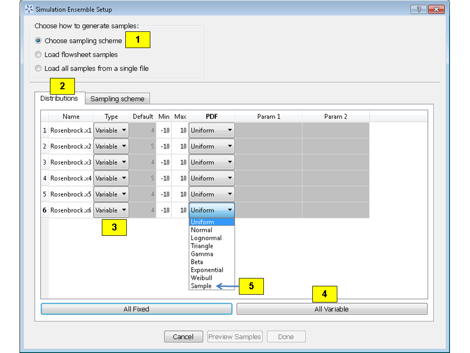

.. _section_uq:

Reference
=========

The Uncertainty Quantification (UQ) module of FOQUS provides a multitude
of analysis and visualization capabilities to facilitate the
understanding of uncertainty’s impact on a given system. In a generic UQ
study, the workflow is usually comprised of the following steps:

#. Define the objectives of the analysis.

#. Specify and acquire the simulation model, which implements an
   input-to-output mapping from inputs to outputs.

#. Select the inputs that have uncertainty and characterize said
   uncertainty in the form of *prior* distributions.

#. Identify relevant data from physical experiments that can be used to
   refine these prior distributions on the inputs.

#. Generate a set of input samples according to the input distribution.

#. Propagate the set of input samples through the simulation model to
   get the corresponding output values.

#. Analyze the results to make informed decisions about subsequent
   analyses.

FOQUS UQ provides tools to perform Steps 5-7. With respect to Step 7, a
variety of analysis capabilities are available. They include parameter
screening methods, response surface construction/validation/prediction,
uncertainty analysis, sensitivity analysis, and visualization.

In this chapter, components of the UQ user interface are first
explained, then the use of these components for UQ analyses is
illustrated.

UQ User Interface
-----------------

The UQ module enables the user to perform UQ studies on a flowsheet.
From the Uncertainty button on the Home window, the user can configure
different simulation ensembles (different sets of samples generated
using different sampling schemes), run them, and perform analyses. This
screen is illustrated in Figure :ref:`fig:uq_screen`.

   Uncertainty Quantification Screen

#. **Simulation Ensemble Table** displays all of the simulation
   ensembles: each ensemble being a row in the table. A simulation
   ensemble is a collection of sample points where each sample point has
   a different set of values for the uncertain variables. The values of
   these variables are generated based on the sampling scheme designated
   by the user. When launched, the output values of the sample points
   are calculated based on the generated sample input values.
   Subsequently, the corresponding simulation outputs can be analyzed.
   For each ensemble, the table displays the **Ensemble** index, **Run
   Status** (how many have been completed), **Setup** and **Launch**
   options (discussed below), and a **Descriptor**. The **Descriptor**
   contains the name of the corresponding node in the flowsheet or the
   name of the file if the ensemble was loaded from a file. Additional
   sample information such as **# Inputs**, **# Outputs**, **Sample
   Design**, and **Sample Size** are also displayed on the right.

#. | **Add New** creates a simulation ensemble (a set of input samples)
     as a new row in the **Simulation Ensemble Table**. Once clicked, a
     dialog is displayed to prompt the user to choose between using (1)
     a flowsheet (an exact simulation model) or (2) a response surface
     (an approximate simulation model or an emulator) associated with
     the ensemble.
   | If using an emulator, the user must browse a PSUADE-formatted file
     that contains the training data for the emulator (in this version,
     the response surface type has been designated inside the sample
     file and can only be changed by editing the sample file) and select
     the output(s) to be evaluated by the trained emulator.
     Subsequently, a simulation setup dialog box is displayed for
     setting up the distributions of input variables and the sampling
     scheme to generate samples of the uncertain input variables. This
     **Simulation Ensemble Setup** dialog is explained in further detail
     in Section :ref:`subsec:uq_simsetup`.

#. **Load from File** loads a simulation ensemble from a sample file
   that conforms to the PSUADE full file format. (See Section
   :ref:`file-formats` for details on the PSUADE full
   file format.) The user can click **Save Selected** to save an
   existing ensemble as a PSUADE full file, and load it by clicking
   **Load from File** to perform further analyses.

#. **Clone Selected** clones the selected simulation ensemble and adds
   the copy as a new row at the end of the table. This ensemble can then
   be edited (e.g., depending on whether the ensemble has been run, the
   user has different options for modifying the ensemble). This allows
   the user to create a new ensemble similar to the current ensemble
   without having to start from scratch (i.e., setting up the input
   parameters). For example: (1) **Clone Selected** can be used in
   conjunction with **Load from File** to clone an existing ensemble
   before input/output modification to prepare a new but similar
   ensemble for UQ analysis. (2) **Clone Selected** can also be used to
   prepare a fresh ensemble for evaluation via a different simulation
   model. In this case, the user should save the cloned ensemble, reload
   it by clicking **Add New**, associate it with a node, and then click
   **Launch** to start the runs.

#. **Delete Selected** deletes the currently selected simulation
   ensemble.

#. **Revise** enables a user to change a simulation ensemble before
   launching the run. If the ensemble was previously run or it is cloned
   from an already-generated sample, the corresponding button becomes
   **View** so the user can view the input samples in the simulation
   ensemble.

#. **Launch** starts the simulation process of the ensemble. (**Launch**
   is not enabled until the user has setup everything needed for
   simulations.) A simulation is launched for each sample point to
   compute the corresponding outputs.

#. **Analyze**, when enabled (after all simulation results are ready),
   enables the user to perform various UQ analysis to the ensemble. When
   clicked, a new dialog box displays, allowing the user to configure
   and run analysis.

#. **Data Manipulation** enables (1) the deletion of inputs, outputs, or
   samples, (2) the modification of output values for specific sample
   points, and (3) the range-based filtering of samples.

#. **Inspection/Deletion/Output Value Modification** serves three
   purposes: it enables the user to (1) view the numerical values of
   samples in table form, (2) delete variables and/or samples, and (3)
   edit the output values of specific samples. **Deletion** creates a
   new simulation ensemble as a new row in the simulation table that
   contains only those inputs/outputs and samples that were not selected
   for deletion. **Output Value Modification** changes the values within
   the ensemble itself.

#. **Filtering** enables the user to filter samples based on the values
   of an input or output. First, select the ensemble to be filtered from
   the **Simulation Ensemble Table**. Once filtering is complete, a new
   simulation ensemble is added as a new row in the simulation table.
   The new simulation ensemble contains only those samples that satisfy
   the filtering criterion (with input or output samples within the
   specified range).

#. **Reset Table** resets the table to default, meaning all variable and
   sample selections are unselected and output values within the table
   are reverted back to their original values, thus undoing any edits to
   the table.

#. The table displays the values of inputs and outputs for each sample.
   Inputs are highlighted in pink; outputs are highlighted in yellow.
   The user can select which variables (columns) to delete by selecting
   the checkboxes on top. Likewise, the user can select which samples
   (rows) to delete by selecting the checkboxes on the left. Multiple
   samples can also be selected/deselected by using (1) Shift+Click or
   Ctrl+Click to select multiple rows, or (2) right-clicking to bring up
   a menu to check or uncheck the checkboxes corresponding to the rows
   of the selected samples. In addition, the user can change any output
   value by editing the appropriate cell. These modified cells are
   highlighted green until changes are made permanent by clicking the
   appropriate button.

#. **Perform Deletion then Save as New Ensemble** creates a new
   simulation ensemble as a new row in the **Simulation Ensemble
   Table**. The new ensemble is without the variables and samples that
   were previously selected for removal.

#. **Make Output Value Changes Permanent** overwrites the output values
   in the current ensemble with those that are highlighted green in the
   table.

   .. raw:: latex

      \suspend{enumerate}

   The **Filtering** tab is illustrated in Figure :ref:`fig:uq_deltab` and
   enables the user to filter samples based on the values of an input or output.

   .. figure:: figs/overview/2_FilteringTab_upd1.png
      :alt: Filtering Tab
      :name: fig:uq_deltab

      Filtering Tab

   .. raw:: latex

      \resume{enumerate}
      
   .. figure:: figs/overview/2_FilteringTab_upd2.png
      :alt: Filtering Dialog Box

      Filtering Dialog Box
      
   .. raw:: latex

      \resume{enumerate}

#. Click on Add/Edit Filters, in the Flowsheet Results window within the
   "Filtering Tab"

#. 1. Within the Filter Dialog Box, Click on "New Filter" to add a filter
   2. Enter a filter expression in python format. Variables can be dragged into
      the expression, from the "Columns", click Done.

#. Select a "Current Filter" after which the the filtered ensemble can be saved
   by clicking on " Save as New Ensemble"

   The single-output **Analysis of Ensemble** dialog, which is displayed when
   **Analyze** is clicked for the selected ensemble, has two modes, as shown in
   Figure :ref:`fig:uq_analysisW` and Figure :ref:`fig:uqt_rsaeua`.

   .. figure:: figs/overview/3_AnalysisSection2.png
      :alt: Analysis Dialog, Ensemble Data Analysis, Wizard Mode
      :name: fig:uq_analysisW

      Analysis Dialog, Ensemble Data Analysis, Wizard Mode

   .. raw:: latex

      \resume{enumerate}

#. Select **Wizard** or **Expert** mode. The **Wizard** mode provides
   more detailed guidance on how to perform UQ analysis. For users
   familiar with UQ analysis techniques, the **Expert** mode provides
   more functionality and flexibility but with less guidance on its use.
   For example, users will be able to customize the input distributions,
   as well as run more advanced uncertainty analysis that handles both
   epistemic and aleatory uncertainties.

#. The **Analyses Performed** section provides the user a history of
   previous analyses that were performed. The results of these analyses
   are cached, so the user can plot the analysis results without having
   to recompute them.

#. The **Analysis Table** populates as the user performs analyses. It
   lists previous analyses that the user has performed, along with some
   of the main analysis settings (analysis type, inputs and outputs
   analyzed, etc.)

#. Depending on the type of analysis performed, the **Additional Info**
   button displays any additional settings or parameters set by the user
   in the selected analysis that were not shown in the **Analysis
   Table**.

#. The **Results** button will display the results of the selected
   analysis.

#. The **Delete** button will delete the selected analysis from the
   history of previous analyses. Once deleted, the user will need to
   perform the analysis again to see its results.

#. The **Qualitative Parameter Selection** (top part of the **Analysis
   of Ensemble** dialog) houses the controls for parameter selection
   analysis. Parameter selection is a qualitative sensitivity analysis
   method that identifies a group of dominant input parameters that are
   recommended for inclusion in subsequent UQ analyses, as they are the
   ones that most impact the output uncertainty. The parameter screening
   results are shown as bar graphs so that the user can rank the
   uncertain parameters visually.

#. Before performing parameter selection, the user must select a single
   output for identifying parameter sensitivities from the **Choose
   output to analyze** drop-down list.

#. There are several methods of parameter selection. The list of
   parameter selection methods available depends on the sample scheme of
   the selected ensemble. Select the appropriate method from the
   **Choose Parameter Selection Method** drop-down list. Then click
   **Compute input importance** to start the analysis.

#. The **Ensemble Data** radio button directs FOQUS to perform analyses
   on the raw ensemble data.

#. To view plots of the raw ensemble data, choose the desired input(s)
   from the **Select the input(s)** drop-down lists. Then click
   **Visualize**. If multiple inputs are selected, each must be unique.

#. To perform an analysis, select the desired analysis (“Uncertainty
   Analysis” or “Sensitivity Analysis”) from the **Choose UQ Analysis**
   drop-down list. Uncertainty Analysis computes and displays the
   probability distribution of the single selected output parameter and
   displays its sufficient statistics, such as mean, standard deviation,
   skewness, and kurtosis. Sensitivity Analysis computes and displays
   each uncertain input parameter’s contribution to the total variance
   of the output. If Sensitivity Analysis is selected, choose the type
   of sensitivity analysis desired in the next drop-down list. There are
   three options for Sensitivity Analysis: (1) first-order, (2)
   second-order, and (3) total-order.

   -  First-order analysis examines the effect of varying an input
      parameter alone.

   -  Second-order analysis examines the effect of varying pairs of
      input parameters.

   -  Total-order analysis examines all interactions’ effect of varying
      an input parameter alone and as a combination with any other input
      parameters.

   Click **Analyze** to run the analysis. (Note: Raw ensemble data
   analysis may not be suitable if the sample size is small. It may be
   useful if the data set has tens of thousands of sample points or if
   an adequate response surface cannot be constructed. Otherwise,
   response surface-based analyses are recommended.)

   .. figure:: figs/overview/4_Analyze2.png
      :alt: Analysis Dialog, Response Surface Analysis, Wizard Mode
      :name: fig:uq_analysisW2

      Analysis Dialog, Response Surface Analysis, Wizard Mode

#. **Response Surface** enables the user to perform all analyses related
   to response surfaces. A response surface is an approximation of the
   input-to-output relationship. This is an inexpensive way to
   approximate the values of outputs given different input values when
   the actual simulation of output values is computationally intensive.
   FOQUS uses the data (i.e., input-output samples) to fit a response
   surface scheme. The first step in this analysis is to select which
   output to analyze.

#. Select the **Response Surface Model** to be used to approximate the
   input-to-output mapping. Selection of “Polynomial” or “MARS” requires
   one further selection in the second drop-down list. If “Polynomial”
   is chosen in the first drop-down list and “Legendre” is chosen in the
   second drop-down list, the user needs to specify a number for the
   **Legendre polynomial order** before analysis can proceed.

#. The response surface selected must be validated before further
   analyses can be performed. The user can specify the error envelope
   for the validation plot. When **Validate** is clicked, the resulting
   plots display the best fit between the response surface (based on the
   model selected) and the actual data.

#. **Choose UQ Analysis** enables the user to perform
   response-surface-based UQ analyses. Select the analysis in the first
   drop-down list. If the desired analysis is Sensitivity Analysis,
   select the desired type of sensitivity analysis in the second
   drop-down list and then click **Analyze**. **Uncertainty Analysis**
   and **Sensitivity Analysis** compute and display the same quantities
   as in item 30. However, the results displayed are based on samples drawn
   from the trained response surface, not the simulation ensemble itself.
   Moreover, if the selected response surface has uncertainty, the resulting
   plots also reflect this uncertainty information.

#. FOQUS also provides visualization capabilities, enabling the user to
   view the response surface as a function of one or multiple inputs. Up
   to three inputs can be visualized at once. Click **Visualize** to
   view. A 2-D line plot displays if only one input parameter is
   selected. A 3-D surface plot and a 2-D contour plot display if two
   input parameters are selected. A 3-D isosurface plot with a slider
   bar displays if three input parameters are chosen. For the isosurface
   plot, the user can use the slider to selectively display the 3-D
   input parameter space that activates a particular range in the output
   parameter.

   Finally, the **Bayesian Inference of Ensemble** dialog (shown in Figure
   :ref:`fig:uq_inf`) is used to calculate the posterior distributions (prior
   distributions integrated with data) of the uncertain input
   parameters. Inference utilizes Markov Chain Monte Carlo (MCMC) to compute the
   posterior distributions, using response surfaces that serve as fast
   approximations to the actual simulation model.

   .. figure:: figs/overview/5_InferenceWizard2.png
      :alt: Bayesian Inference Dialog
      :name: fig:uq_inf

      Bayesian Inference Dialog

   .. raw:: latex

      \resume{enumerate}

#. Inference uses a response surface to approximate the input-to-output
   mapping. In **Output Settings**, select the observed outputs and
   select the response surface type that works best with each observed
   output. As in item 32, further selections
   may be required based on the response surface chosen. The simulation
   ensemble is used as the training data for generating the response
   surfaces.

#. The user can specify which inputs are fixed, design (fixed per
   experiment, but changes between experiments), or variable using the
   **Input Settings Table**. In addition, the user can specify which
   inputs are displayed in the resulting plots of the posterior
   distributions. By default, once inference completes, all inputs will
   be displayed in the plots. To omit specific inputs, clear the
   checkboxes from the **Display** column of the table. Finally, in
   **Expert** mode, this table can also be used to modify the input
   prior distributions. The default prior is the input distribution
   specified in the simulation ensemble. To change the prior
   distribution type, use the drop-down list in the **PDF** column and
   enter corresponding values for the PDF parameters. To change the
   range of a uniform prior, scroll all the way to the right to modify
   **Min/Max**.

#. The **Observations** section enables the user to add experimental
   data in the form of observations of certain output variables. At
   least one observation is required. Currently, the observation noise
   model is assumed to be a normal distribution. Other distributions may
   be supported in the future. To specify the observation noise model,
   enter the mean (and standard deviation, if standard inference is
   selected) for each output observation. For convenience, the **Mean**
   and **Standard Deviation** fields have been populated with the
   statistics from the ensemble uncertainty analysis. If any inputs are
   selected as design inputs, their values will also be required here.

#. **Save Posterior Input Samples to File** checkbox, when selected,
   saves the posterior input samples as a PSUADE sample file (format
   described in Section :ref:`file-formats`). This
   file characterizes the input uncertainty as a set of samples, which
   can be re-used in the **Simulation Ensemble Setup** dialog, to
   evaluate the outputs corresponding to these posterior input samples.

#. If saving posterior samples to a file, click **Browse** to set the
   name and location of where this file is saved.

#. Click **Infer** to start the analysis. (Note: If the inference
   returns an invalid posterior distribution (i.e., one with no
   samples), it usually means the prior distributions or that the
   observation data distributions are not prescribed appropriately. In
   this case, it is recommended that the user experiment with different
   priors and/or data distribution means and/or standard deviations.)

#. Inference calculations often take a very long time. If inference has
   run to completion, use Replot to generate new plots (e.g., to only
   display a subset of the input posterior graphs) from the cached
   inference results.

.. _subsec:uq_simsetup:

Simulation Ensemble Setup Dialog
~~~~~~~~~~~~~~~~~~~~~~~~~~~~~~~~

The **Simulation Ensemble Setup** dialog (shown in Figure
:ref:`fig:uq_sim_dist`) is used to create a new simulation ensemble. This is
done by: (1) setting up distribution parameters and generating samples, or (2)
loading samples from a file.  This dialog is displayed when selecting **Add
New** on the UQ window (Figure :ref:`fig:uq_screen`).

   Simulation Ensemble Setup Dialog, Distributions Tab

#. Choose how to generate samples. There are three options: (1) **Choose
   sampling scheme** (default), (2) **Load flowsheet samples**, or (3)
   **Load all samples from a single file**. The option 3 is explained in
   item 11.

#. If **Choose Sampling Scheme** is selected, the **Distributions** tab
   is displayed. The user specifies the input uncertainty information.

#. The **Distributions Table** is pre-populated with input variable
   information gathered from the flowsheet node. Under the **Type**
   column drop-down list, the user can select “Fixed” or “Variable”.
   Selecting “Fixed” means that the input is fixed at its default value
   for all the samples. Changing the type to “Variable” means that the
   input is uncertain; therefore, its value varies between samples. With
   any fixed input, the only parameter that can be changed is the
   **Default** value (i.e., all samples of this input are fixed at this
   default value). With any variable input, the **Min/Max** values, as
   well as the probability distribution function (**PDF**), for that
   input can be changed. Some PDFs have their own parameters (e.g., mean
   and standard deviation for a normal distribution), which are required
   in the columns right of the distribution column. See the PSUADE
   manual for more details on the different PDFs.

#. **All Fixed** and **All Variable** are convenient ways to set all the
   inputs to variable or fixed.

#. Note: A “Sample” PDF refers to sampling with replacement (i.e., input
   samples would be randomly drawn, with replacement, from a sample
   file). If the selected distribution for any input is “Sample”, then
   the following parameters are required: (1) the path of the sample
   file (which must conform to the sample format specified in Section
   :ref:`file-formats`); (2) the output index that
   designates which output is to be used.

#. In the **Sampling scheme** tab (Figure :ref:`fig:uq_sim_samplescheme`),
   specify the sampling scheme, the sample size, and perform sample generation.

   .. figure:: figs/overview/7_SimSetupSchemes2.png
      :alt: Simulation Ensemble Setup Dialog, Sampling Scheme Tab
      :name: fig:uq_sim_samplescheme

      Simulation Ensemble Setup Dialog, Sampling Scheme Tab

#. Each radio button displays a different list of sampling schemes on
   the right. The radio buttons serve as a guide to help in the
   selection of the appropriate sampling schemes for target analyses. A
   sampling scheme must be selected from the list on the right to
   proceed.

#. Set the number of samples to be generated from the **# of samples**
   spinbox.

#. When all parameters are set, click **Generate Samples**. This
   generates the values for all the input variables, based on the
   sampling scheme selected.

#. Once samples have been generated, click **Preview Samples** to view
   the samples that were generated. This displays the sample values in
   table form, as well as graphically as a scatter plot.

#. From item 1, if the user elects to load all samples from a single file,
   click **Browse** to select the file containing the samples (Figure
   :ref:`fig:uq_sim_loadsample`. This file must
   conform to the PSUADE full file format, the PSUADE sample format, or
   CSV file (all formats described in Section
   :ref:`file-formats`). Note: This is the only place
   where all the formats are supported. Once the file is loaded, the
   file name displays in the text box. These samples can now be used in
   the same way as an ensemble that was newly generated (as described
   above).

   .. figure:: figs/overview/8_SimSetupLoad2.png
      :alt: Simulation Ensemble Setup Dialog, Load Samples Option
      :name: fig:uq_sim_loadsample

      Simulation Ensemble Setup Dialog, Load Samples Option