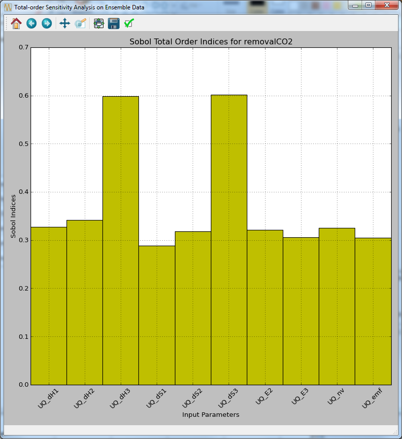

Tutorial 3: Single-Output Analysis
==================================

From the Single-Output Analysis Screen, the user can perform analyses
that are specific to a particular output of interest. Here, the
“removalCO2” output parameter is discussed.

The files for this tutorial are located in: **examples/tutorial_files/UQ/Tutorial_3** 

.. note:: |examples_reminder_text|

Parameter Selection
~~~~~~~~~~~~~~~~~~~

For simulation models that have a large number of input parameters, it
is common practice to down-select to a smaller subset of the most
important input parameters that are most relevant to the output of
interest. This is done so subsequent detailed studies can be performed
more efficiently. By using a smaller set of inputs, a smaller set of
samples may be needed.

#. From the UQ window, load the file “gmoat5012_9levels.filtered” in
   examples\tutorial_files\UQ\Tutorial_3. (This file contains the same set of samples that
   resulted from data filtering. They are included here to make each
   demo self-inclusive.)

#. Click **Analysis**. A new page is displayed (Figure
   `[fig:uqt_analysis_param] <#fig:uqt_analysis_param>`__).

   .. figure:: ../figs/tutorial/15_ParameterSelection2.png
      :alt: Analysis Dialog, Parameter Selection

      Analysis Dialog, Parameter Selection

   [fig:uqt_analysis_param]

#. Under the Qualitative Parameter Selection section, select
   “removalCO2” as the output.

#. Select “MOAT” as the method to be used.

#. Click **Compute input importance**. A graph should appear with the
   results (Figure
   `[fig:uqt_param_results] <#fig:uqt_param_results>`__).

   .. figure:: ../figs/tutorial/16_ParamSelectionResults.png
      :alt: Parameter Selection Results

      Parameter Selection Results

   [fig:uqt_param_results]

The bars in the plot represent the importance of a particular input in
determining the value of the output. For example, the values of dH3 and
dS3 are very important in determining the value of removalCO2, whereas
Hce and hp have no affect (the y-axis displays the average changes in
the model output as a result of changing the inputs in their respective
ranges. For example, from Figure
`[fig:uqt_param_results] <#fig:uqt_param_results>`__, changing dH3 in
its range results in an average change in CO\ :math:`_2` removal as much
as about 57 percent with a margin of +/- 3 percent). Thus, it would be
safe to exclude any inputs that have negligible bar lengths from
analysis. Next, down-select the ten most important inputs based on these
results. See Section `[subsubsec:uqt_vardel] <#subsubsec:uqt_vardel>`__
for details. Change the number of samples and scheme as desired and then
generate new samples. Click **Launch** to run these samples to obtain
another simulation ensemble that can be analyzed.

Ensemble Data Analysis
~~~~~~~~~~~~~~~~~~~~~~

If the user is interested in the output uncertainty of “removalCO2”
based on the uncertainties from the ten most important input parameters,
perform uncertainty analysis, which would compute the probability
distribution and sample statistics of “removalCO2.”

#. Load “lptau20k_10inputs_4outputs.filtered” from the examples\tutorial_files\UQ\Tutorial_3
   folder. Assume this is the file that the user would receive after
   running the cloned simulation ensemble in which the user has
   down-selected the ten most important inputs, set the Sampling Scheme
   to “Quasi-Monte Carlo (LPTAU)”, set the sample size to 20K, and
   performed data filtering to retain only the samples with the status
   output equal to “0.”

#. Click Analyze. A new page displays
   (Figure\ `[fig:uqt_analysis_ua] <#fig:uqt_analysis_ua>`__\ ).

#. Select “Ensemble Data” to indicate that analysis is to be directly
   performed on the raw sample data.

#. Select “removalCO2” as the output variable to analyze.

#. Select “Uncertainty Analysis” and then click Analyze.

   .. figure:: ../figs/tutorial/17_UAScreen2.png
      :alt: Analysis Dialog, Ensemble Data Uncertainty Analysis

      Analysis Dialog, Ensemble Data Uncertainty Analysis

   [fig:uqt_analysis_ua]

   Once uncertainty analysis is complete, results display (Figure
   `[fig:uqt_ua_results] <#fig:uqt_ua_results>`__) illustrating the
   probability distribution function (PDF), cumulative distribution
   function (CDF), and the sufficient statistics (e.g., mean, standard
   deviation) of “removalCO2” (top left corner of the PDF plot). This is
   used to evaluate if the output uncertainty is acceptable. If the
   output uncertainty is too great or the user prefers the system to
   operate within a higher percentage of capture, pursue further
   analyses to understand the relationships between the inputs and
   outputs, and investigate what can be done to reduce the output
   uncertainties by reducing the input uncertainties.

   .. figure:: ../figs/tutorial/18_UAResults.png
      :alt: Ensemble Data Uncertainty Analysis Results

      Ensemble Data Uncertainty Analysis Results

   [fig:uqt_ua_results]

   Next, the user may apply variance-based sensitivity analysis to
   quantify each input’s contribution to the output variance:

   .. raw:: latex

      \resume{enumerate}

#. From the bottom of the “Analysis” section, select “Sensitivity
   Analysis.”

#. There are three options for sensitivity analysis: (1) first-order,
   (2) second-order, and (3) total-order. First-order analysis examines
   the effect of varying an input parameter alone. Second-order analysis
   examines the effect of varying pairs of input parameters. Total-order
   analysis examines all interactions’ effect of varying an input
   parameter alone and as a combination with any other input parameters.
   For this demonstration, select “Total-order” and click Analyze. The
   total sensitivity indices display in a graph. Note: If the simulation
   ensemble has more than ten inputs, “Total-order” is disabled (since
   any reasonable sample size is not sufficient). Additionally, since
   quantitative sensitivity analysis in general requires large ensembles
   with many samples (thousands or more), ensemble sensitivity analysis
   (without the use of response surfaces) is often less practical and
   accurate than response surface based analyses. The result is
   illustrated in
   Figure\ `[fig:uqt_sa_results] <#fig:uqt_sa_results>`__\ .

   Ensemble Data Total-order Sensitivity Analysis Results

[fig:uqt_sa_results]

These results confirm that “removalCO2” is more sensitive to “dH3” and
“dS3” than other inputs. (The y-axis displays an approximate percentage
of output variance attributed to each individual parameter. Since total
sensitivity includes higher order interaction terms with other
parameters, the sum of these total sensitivity indices usually exceeds
1.)

Ensemble Data Visualization
~~~~~~~~~~~~~~~~~~~~~~~~~~~

#. In this release, ensemble data visualization is only available in
   “Expert” mode. At the top of the “Analyze” page, toggle the bar to
   expert mode and select “removalCO2” as the output. Next, to
   “Visualize Data,” choose an input (e.g., “UQ_dH1”) and click
   **Visualize** for a 2-D scatter plot of “removalCO2” versus that
   input (Figure
   `[fig:uqt_splot1_results] <#fig:uqt_splot1_results>`__).

   .. figure:: ../figs/tutorial/20_VisOneInput.png
      :alt: Ensemble Data Visualization of One Input

      Ensemble Data Visualization of One Input

   [fig:uqt_splot1_results]

#. Next, select a second input (e.g., “UQ_dH2”) and click **Visualize**
   for a 3-D scatter plot of “removalCO2” versus the two inputs. (Note:
   The input selections must be unique for the **Visualize** button to
   be enabled.) Figure
   `[fig:uqt_splot2_results] <#fig:uqt_splot2_results>`__ shows the
   results.

   .. figure:: ../figs/tutorial/21_VisTwoInputs.png
      :alt: Ensemble Data Visualization of Two Inputs

      Ensemble Data Visualization of Two Inputs

   [fig:uqt_splot2_results]

   The plot in Figure
   `[fig:uqt_splot2_results] <#fig:uqt_splot2_results>`__ can be rotated
   by clicking and dragging.
