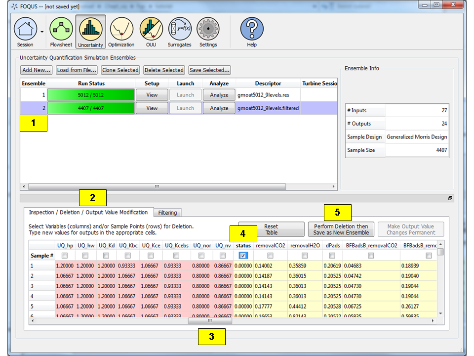

Tutorial 2: Data Manipulation
=============================

In this tutorial, instructions to change the data before analysis are
described. Current capabilities include sample filtering, input/output
variable deletion, and output value modification.

The files for this tutorial are located in: **examples/tutorial_files/UQ/Tutorial_2**

.. note:: |examples_reminder_text|

Filtering
~~~~~~~~~

Filtering involves selecting out samples whose values of a certain input
or output fall into a certain range. When runs are returned
from the Turbine Web API there often are simulations that failed to
converge in Aspen, thus the simulation samples corresponding to these
failed runs should be excluded from analysis. Follow the steps below to
filter out the samples due to failed runs:

#. Click Load from File on the UQ window (Figure :ref:`fig:uqt_data_filter`).

#. Select the file “gmoat5012_9levels.res” in the examples\UQ folder.
   This file is an actual simulation ensemble that has already been run. 
   To find this file, the user may need to change the file filter to “All files.”

#. Select the Filtering tab.

   .. raw:: latex

      \centering

   .. figure:: ../figs/tutorial/Data_Manipulation_Filtering_Tab_1.png
      :alt: Data Manipulation, Filtering Tab
      :name: fig:uqt_data_filter

      Data Manipulation, Filtering Tab
      
#.  Filtering the loaded simulation ensemble based on output values is performed.

    #. Click on "New Filter", and create a filter named "f1"
    #. Add the Filter Expression c("output.status") == 0, since the user should
       keep only the samples in which the output parameter status is “0.”
    #. Click "Done"

       .. figure:: ../figs/tutorial/Data_Manipulation_Filtering_Tab_2.png
          :alt: Data Manipulation, Filtering Dialog Box

          Data Manipulation, Filtering Dialog Box
       
    #. Select 'f1' as the " Current Filter" in the Flowsheet Result window
       within "Filtering Tab"
    #. Once the Filtering is complete, click on "Save as New Ensemble" and a new
       row should be added to the simulation table      

       .. figure:: ../figs/tutorial/Data_ManipulationFiltering_Results.png
          :alt: Data Manipulation, Applying the filter

          Data Manipulation, Applying the filter

#. Once filtering is complete, a new row should be added to the
   simulation table (Figure :ref:`fig:uqt_data_filter_results`).
   This ensemble contains only those samples that have a status value of
   “0.” Analysis can now be performed on this new ensemble because this
   ensemble contains only the valid simulations (i.e., those with output
   status value of 0), in which Aspen calculations have properly
   converged.

   .. figure:: ../figs/tutorial/12_FilterResults2.png
      :alt: Data Manipulation, Filtering Results
      :name: fig:uqt_data_filter_results

      Data Manipulation, Filtering Results

.. _subsubsec:uqt_vardel:

Variable Deletion
~~~~~~~~~~~~~~~~~

If an input or output variable is to be removed from consideration for
analysis, this can be done in the **Inspection/Deletion/Output Value
Modification** tab. Delete the status output from the previous filtering
as it is no longer needed for further analysis.

#. Verify that the ensemble that resulted from filtering is selected. If
   not, select that ensemble.

#. Click the Inspection/Deletion/Output Modification tab.

#. Scroll to the right of the table to the outputs, which are colored
   yellow.

#. Select the checkbox corresponding to the “status” output (the first
   output).

#. Click Perform Deletion then Save as New Ensemble.

The results are illustrated in Figure :ref:`fig:uqt_data_mod`. Note: The output
count has decreased by one for the new ensemble. The user can verify that the
“status” output was removed in the new ensemble by viewing this in the
**Inspection/Deletion/Output Value Modification** tab again. Deletion of an
input can be performed similarly by selecting its checkbox and clicking the
**Perform Deletion then Save as New Ensemble** button.

   Data Manipulation, Inspection/Deletion

Output Value Modification
~~~~~~~~~~~~~~~~~~~~~~~~~

To change the value of an output for a sample or several samples, follow
steps below:

#. Select an ensemble.

#. Click the Inspection/Deletion/Output Value Modification tab.

#. Scroll to the right to the outputs.

#. Click on a cell for one of the outputs and enter a new value. Do the
   same for another cell. Notice that the modified cells turn green.
   This indicates the cells that have been modified.

#. Click Make Output Value Changes Permanent to permanently change the
   values. The modified cells will turn yellow, indicating the permanent
   change. If the user wishes to reset the table and start over before
   making changes permanent, click the Reset Table.

.. figure:: ../figs/tutorial/14_DataManipulation_OutputModification2.png
   :alt: Data Manipulation, Value Modification
   :name: fig:uqt_data_mod_output

   Data Manipulation, Value Modification

.. raw:: latex

   \pagebreak
