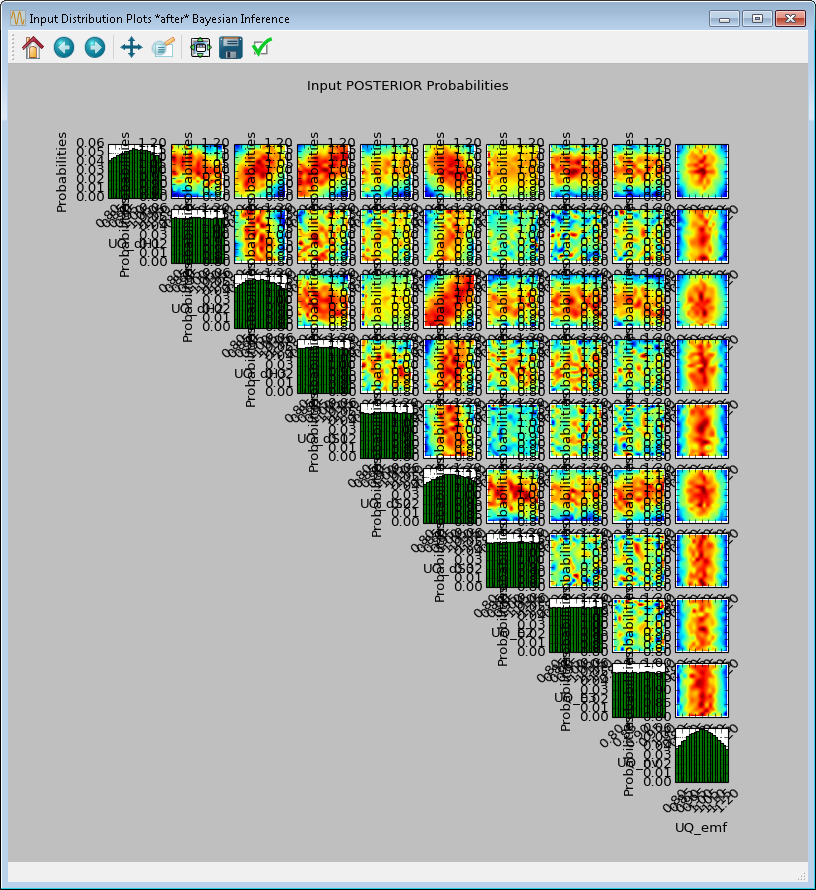

Tutorial 5: Bayesian Inference
==============================

For each output variable, the user specifies an observed value (from
physical experiments) with the associated uncertainties (in the form of
standard deviation), if applicable. Whether standard inference or
SolventFit is selected, the tool will launch a Markov Chain Monte Carlo
(MCMC) algorithm to compute the posterior distributions of the uncertain
input parameters. These input posterior distributions represent a
refined hypothesis about the input uncertainties in light of what was
previously known (in the form of input prior distributions) and what was
observed currently (in the form of noisy outputs).

The file for this tutorial is **lptau100_10inputs_4outputs.filtered**, and
this file is located in: **examples/tutorial_files/UQ/Tutorial_5**

.. note:: |examples_reminder_text|

#. Load the “lptau5k_10inputs_4outputs.filtered” file from the
   above-mentioned folder.

#. Click **Analyze** for the current ensemble and a new dialog box
   displays (Figure
   `[fig:uqt_analysis_infer] <#fig:uqt_analysis_infer>`__).

   .. figure:: ../figs/tutorial/29_InfSelection2.png
      :alt: Analysis Dialog, Bayesian Inference

      Analysis Dialog, Bayesian Inference

   [fig:uqt_analysis_infer]

#. Select “Response Surface” in the “Analysis” section.

#. Select “Output variable to analyze” to be “removalCO2.”

#. Select “Linear Regression” as the response surface.

#. Insert 5.00 as the error envelope for the validation plot. Click
   Validate. The GUI allows the user to proceed with Bayesian inference
   after one input has been validated; however, the user may want to
   validate all outputs since they are all used in the inference.

#. Once validation is completed, click Infer at the lower right corner,
   which displays a new dialog box
   (Figure\ `[fig:uqt_infer] <#fig:uqt_infer>`__\ ).

#. In the Output Settings table (on the left), select the second, third,
   and fourth outputs as the observed outputs. The user can experiment
   with using different response surface models (for example, linear
   polynomials) to approximate the mapping from inputs to each of the
   outputs.

#. In the Input Settings table (on the right), designate input types
   (variable, design, or fixed) and if necessary, switch to Expert Mode
   to revise the prior distribution on the input parameters. The prior
   distribution represents knowledge that the user possesses about the
   inputs before observational data (from experiments) has been
   incorporated into this knowledge. If the user does not have any
   updated knowledge about the simulation ensemble, it is OK to leave
   the table as is.

#. In the **Observations** table (in the middle), select the number of
   experiments from which the user can get observational data. In
   essence, if the user has :math:`N` observations, then :math:`N`
   should be set as the number of experiments. The table will then
   populate columns for design inputs (if any) and observed outputs.
   Currently, only normal distribution is supported as the noise model
   for observations. Enter the mean and standard deviation for each of
   these observations. For convenience, the mean and standard deviation
   values are prepopulated with the results from uncertainty analysis.
   These values have been provided as a sanity check for the user, in
   case the observation for a particular output is way out of range from
   these distributions.

   .. figure:: ../figs/tutorial/30_InfScreen2.png
      :alt: Bayesian Inference Dialog for Standard Inference

      Bayesian Inference Dialog for Standard Inference

   [fig:uqt_infer]

#. To save an input sample drawn from the posterior distribution, select
   the Save Posterior Input Samples to File checkbox and select a
   location and file name to store the sample.

#. Click Infer to start the analysis. Inference can take a long time;
   thus, a stop feature has been implemented. Once inference starts, the
   Infer button changes to Stop. To stop inference calculations, click
   Stop which changes the button back to Infer, allowing the user to
   restart the calculations from scratch. If inference is allowed to run
   its course, its results are interpolated to produce heat maps
   (off-diagonal subplots in
   Figure\ `[fig:uqt_infer_results] <#fig:uqt_infer_results>`__\ ) for
   visualization. This interpolation step can take a few minutes and
   while it is running, Infer is disabled.

.. raw:: latex

   \centering

|Bayesian Inference Results1| |Bayesian Inference Results2|

[fig:uqt_infer_results]

Once the inference and interpolation steps are complete, two windows
will be displayed: a multi-plot figure of the prior distributions and
another multi-plot figure of the posterior distributions. If the user
has selected the **Save Posterior Input Samples to File** checkbox, then
a sample file will also be written to the designated file location.

In the resulting prior and posterior plots (Figure
`[fig:uqt_infer_results] <#fig:uqt_infer_results>`__), the univariate
input distributions are displayed as histograms on the diagonal. The
bivariate input distributions (between pairs of inputs) are displayed as
heat maps in the off-diagonal subplots. On these heat maps, the regions
in red reflect the input space with higher probability. In the posterior
plots, the red regions represent inputs that are more likely to have
generated the specified observations on the outputs. By comparing the
prior and the posterior figures, the user can see the ”before” and
”after” impact of inference on our knowledge of the input uncertainty.

To zoom in on any one of the subplots, left-click; to zoom out,
right-click. To display a subset of these subplots, clear the checkbox
for the inputs to be omitted (from the first column of the Input Prior
Table) and click **Replot** (Figure
`[fig:uqt_infer_replot_results] <#fig:uqt_infer_replot_results>`__).

.. raw:: latex

   \centering

|Bayesian Inference Replot Results1| |Bayesian Inference Replot Results2|

[fig:uqt_infer_replot_results]

.. |Bayesian Inference Results1| image:: ../figs/tutorial/31a_InfPriorResults.png

.. |Bayesian Inference Replot Results1| image:: ../figs/tutorial/32a_InfPriorReplotResults.png
.. |Bayesian Inference Replot Results2| image:: ../figs/tutorial/32_InfReplotResults.png
