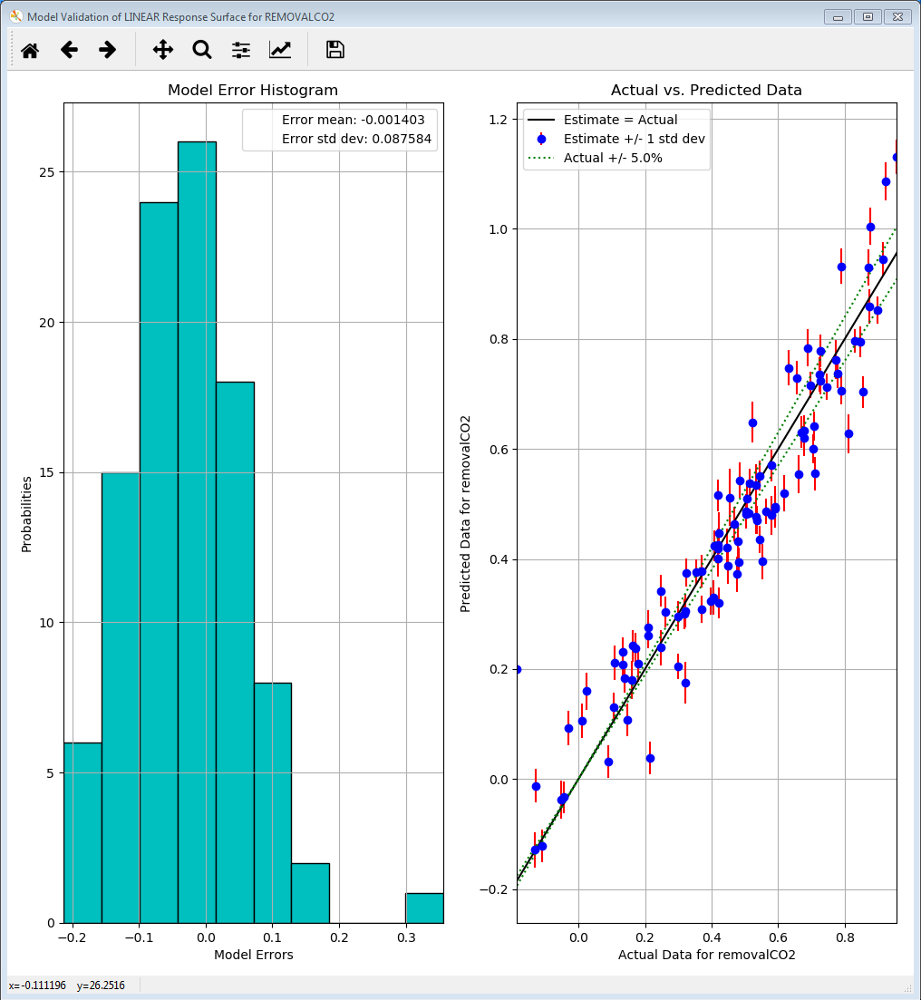

.. _tutorial.uq.rs:

Tutorial 4: Response Surface Based Analysis
===========================================

For simulation models that are expensive to run, response surface
analysis can be a resourceful option. To construct a response surface, a
space-filling sampling design is desired. For example, quasi-Monte Carlo
(LPTAU) or Latin hypercube sampling schemes are recommended.
Additionally, there are several possibilities for curve fitting methods.
If the sample size is relatively small, polynomial regression or
Gaussian process (if installed as part of PSUADE) is preferred.
Alternatively, if the sample size is large enough (one hundred or more),
cubic splines (if installed) may also be feasible.

The file for this tutorial is **lptau100_10inputs_4outputs.dat**, and
this file is located in: **examples/tutorial_files/UQ/Tutorial_4**

.. note:: |examples_reminder_text|

Response Surface Model Validation
~~~~~~~~~~~~~~~~~~~~~~~~~~~~~~~~~

To proceed with response surface based analysis, the user needs to find
a suitable response surface with which to approximate the
input-to-output mapping. Validation is performed to see how well a
particular response surface can predict a subset of the withheld data.

#. Load the “lptau100_10inputs_4outputs.dat” file.
   Note: This is an extremely small simulation ensemble, as this is used
   to highlight the differences (in validation results) between a good
   response surface and a bad one.

#. Click Analyze for the current ensemble. A new dialog page displays
   (Figure\ `[fig:uqt_rs_validate] <#fig:uqt_rs_validate>`__\ ).

#. Under “Analysis” (bottom section), under Step 1, select “Response
   Surface.”

   .. figure:: ../figs/tutorial/22_RSValidationScreen2.png
      :alt: Analysis Dialog, Response Surface Validation of Linear Model

      Analysis Dialog, Response Surface Validation of Linear Model

   [fig:uqt_rs_validate]

#. Under Step 2, select “removalCO2” as the output for analysis.

#. Under Step 3, select “Polynomial” for response surface method.

#. There are multiple types of polynomial response surfaces, with
   increasing complexity as the user navigates down the list. For now,
   select “Linear” in the next drop-down list.

#. Insert 5.00 as the error envelope for the validation plot. Click
   Validate. The result is illustrated in
   Figure\ `[fig:uqt_rs_validate_results] <#fig:uqt_rs_validate_results>`__\ .

   Linear Response Validation Results

[fig:uqt_rs_validate_results]

The cross-validation results for the linear regression model are
displayed as a histogram of errors to the left and a plot of predicted
values versus actual values to the right. The histogram displays the
cross validation error distribution, which provides the user information
on what the errors are like overall. If this distribution is not
centered on zero, there may be a systematic bias in the response surface
model. If the distribution is too wide, it is not a good fit. As for the
plot of predicted values versus actual values, the more closely the
points are to the diagonal, the better the fit. Most response surface
models, with the exception of MARS, also provide uncertainty information
about the response surface. The vertical error bars on the left plot
reflect the uncertainty in the linear response’s predictions.

In summary, these two figures should provide sufficient information for
the user to judge how good the fit is. As is apparent in the figures,
the linear model consistently overestimates and thus is an ill-suited
response surface to model our data. In general, the user may use a few
response surface methods to see which method gives the best fit.

Response Surface Based Uncertainty Analysis
~~~~~~~~~~~~~~~~~~~~~~~~~~~~~~~~~~~~~~~~~~~

These capabilities are similar to those for ensemble data analysis. The
difference is that the results are now derived from a much larger
ensemble that is computed from the response surface. With the 100
samples from the ensemble data, a response surface is trained and is
used to generate 100K samples internally to compute the results for
uncertainty and sensitivity analyses. (Note: Validation must be
performed before these analyses are available.)

After the response surface validation step, select “Uncertainty
Analysis” to be the UQ analysis in Step 7 of “Analysis” (Figure
`[fig:uqt_rs_validate] <#fig:uqt_rs_validate>`__). Click **Analyze** and
a distribution representing the output uncertainty will be displayed
(Figure `[fig:uqt_rsua_results] <#fig:uqt_rsua_results>`__).

.. figure:: ../figs/tutorial/24_RSUAResults.png
   :alt: Response Surface Based Uncertainty Analysis Results

   Response Surface Based Uncertainty Analysis Results

[fig:uqt_rsua_results]

Compare the response surface based uncertainty results (Figure
`[fig:uqt_rsua_results] <#fig:uqt_rsua_results>`__) to the results from
ensemble data analysis (Figure
`[fig:uqt_ua_results] <#fig:uqt_ua_results>`__). The two main
differences are easily seen.

-  Two PDFs on top plot: A response surface (in this case, linear
   regression) is used to predict the output values corresponding to the
   input samples. From the validation step (left plot of
   Figure\ `[fig:uqt_rs_validate_results] <#fig:uqt_rs_validate_results>`__\ ).
   Note: There is error associated with the response surface’s
   predictions. This error is propagated in uncertainty analysis, in the
   form of standard deviations around the predicted output values (i.e.,
   the means).
   Accordingly, two histograms are presented: The “mean PDF” represents
   the output probability distribution computed from the response
   surface’s predicted output values only, without consideration for the
   uncertainties surrounding these predicted values. The “ensemble PDF”
   represents the output probability distribution that encompasses the
   uncertainties surrounding these predicted values. In most cases, the
   ensemble PDF should have a larger spread because it is accounting for
   more uncertainties (i.e., those that stem from the approximations
   inherent in the response surface).

-  Multiple cumulative distribution functions (CDFs) on bottom plot: The
   “mean CDF” is constructed from a cumulative sum on the mean PDF in
   the top plot. Since each predicted output value (i.e., the mean) has
   an associated standard deviation, this information is used to
   construct other PDFs that correspond to output values that are +/- 1,
   2, and 3 standard deviations from the mean. These PDFs are then
   converted to CDFs and shown as colored lines. These colored lines
   provide an uncertainty “envelope” around the mean CDF.

Response Surface Based Mixed Epistemic-Aleatory Uncertainty Analysis
~~~~~~~~~~~~~~~~~~~~~~~~~~~~~~~~~~~~~~~~~~~~~~~~~~~~~~~~~~~~~~~~~~~~

In “Expert Mode”, the user can perform more advanced uncertainty
analysis that handles both epistemic and aleatory uncertainties. To do
so, the user will need to designate the uncertainty type (epistemic or
aleatory) for each uncertain input. In general, epistemic uncertainties
are reducible uncertainties that arise due to lack of knowledge, such as
simplifying assumptions in a mathematical model. Therefore, epistemic
uncertainty is often characterized by upper and lower bounds. On the
other hand, aleatory uncertainties are irreducible uncertainties that
represent natural, physical variability in the phenomenon under study.
As such, aleatory uncertainties are often characterized by
distributions. Hence, the user is required to provide a PDF for each
aleatory input. (In FOQUS, with the exception of mixed
epistemic-aleatory uncertainty analysis, all uncertain inputs are
treated as aleatory inputs.)

To perform mixed epistemic-aleatory uncertainty (Figure :ref:`fig:uqt_rsaeua`),
switch to “Expert Mode” by clicking the **Mode** button that toggles between the
analysis modes.  After response surface validation, select “Uncertainty
Analysis” in the first **Choose UQ Analysis** drop-down list, then
“Epistemic-Aleatory” in the secondary drop-down list, for the UQ analysis. In
the input table, designate the parameter **Type** (“Epistemic”, “Aleatory” or
“Fixed”) and the corresponding information for each input. Once complete, click
**Analyze**. In this tutorial we consider dH1 & dH2 as epistemic uncertain
parameters, and rest of them are aleatory.

.. raw:: latex

   \centering

   Response Surface Based Mixed Epistemic-Aleatory Uncertainty Analysis

The results of mixed epistemic-aleatory uncertainty analysis is a plot (Figure
:ref:`fig:uqt_rsaeua_results`) containing multiple CDFs. In the mixed analysis,
the epistemic inputs are sampled according to their lower and upper bounds. Each
sample point spawns a response surface based uncertainty analysis, in which the
epistemic inputs are fixed at their sampled value and the aleatory input
uncertainties are propagated to generate a CDF that represents the output
uncertainty. A slider is provided for the user to extract the probability range
corresponding to a particular value of the output.

   Response Surface Based Mixed Epistemic-Aleatory Uncertainty Analysis
   Results

Response Surface Based Sensitivity Analysis
~~~~~~~~~~~~~~~~~~~~~~~~~~~~~~~~~~~~~~~~~~~

For quantitative sensitivity analysis, follows these steps:

#. In the Choose UQ Analysis drop-down list (Step 6 of “Analysis”),
   select “Sensitivity Analysis.”

#. In the next drop-down list, select “First-order” and click Analyze.
   (This analysis may take a long time depending on the sample size and
   the response surface used.)

Prediction errors are associated with the response surface’s predictions
of the output values (left plot of Figure
`[fig:uqt_rs_validate_results] <#fig:uqt_rs_validate_results>`__).
Earlier, it was observed that the response surface error contributed to
the output uncertainty, leading to a larger spread in the output PDF
(top plot of Figure `[fig:uqt_rsua_results] <#fig:uqt_rsua_results>`__).
In Figure `[fig:uqt_rssa_results] <#fig:uqt_rssa_results>`__, the
response surface error contributed to uncertainty (shown as blue error
bars) surrounding each input’s contribution to the output variance
(shown as yellow bars).

.. figure:: ../figs/tutorial/25_RSSobol1Results.png
   :alt: Response Surface Based First-order Sensitivity Results

   Response Surface Based First-order Sensitivity Results

[fig:uqt_rssa_results]

Response Surface Based Visualization
~~~~~~~~~~~~~~~~~~~~~~~~~~~~~~~~~~~~

The response surface that has been validated can also be visualized.

#. Select one input next to “Visualize Response Surface.”

#. Click **Visualize** to display a 2-D line plot that displays
   “removalCO2” versus the selected input.

   .. figure:: ../figs/tutorial/26_1DRSVis.png
      :alt: 1-D Response Surface Visualization

      1-D Response Surface Visualization

   [fig:uqt_rs1_results]

#. Select another input next to the first one for a 2-D response surface
   visualization.

#. | Click **Visualize** to display a figure with a 3-D surface plot and
     a 2-D contour plot (Figure
     `[fig:uqt_rs2_results] <#fig:uqt_rs2_results>`__).

   .. figure:: ../figs/tutorial/27_2DRSVis.png
      :alt: 2-D Response Surface Visualization

      2-D Response Surface Visualization

   [fig:uqt_rs2_results]

#. Select another input next to the second one for a 3-D response
   surface visualization.

#. Click **Visualize** to display a 3-D isosurface plot. Move the slider
   to see the points in the 3-D input space that fall within the small
   range of “removalCO2” (Figure
   `[fig:uqt_rs3_results] <#fig:uqt_rs3_results>`__).

   .. figure:: ../figs/tutorial/28_3DRSVis.png
      :alt: 3-D Response Surface Visualization

      3-D Response Surface Visualization

   [fig:uqt_rs3_results]
