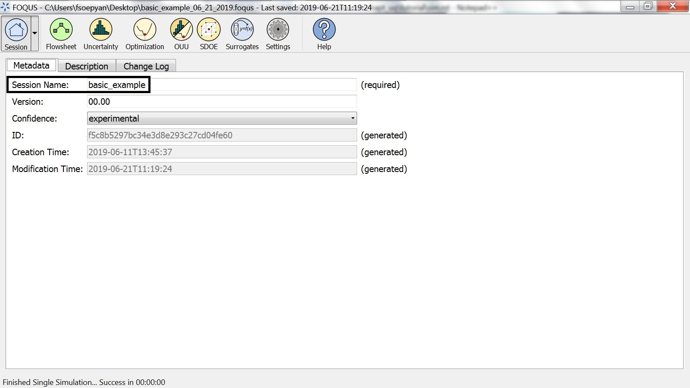
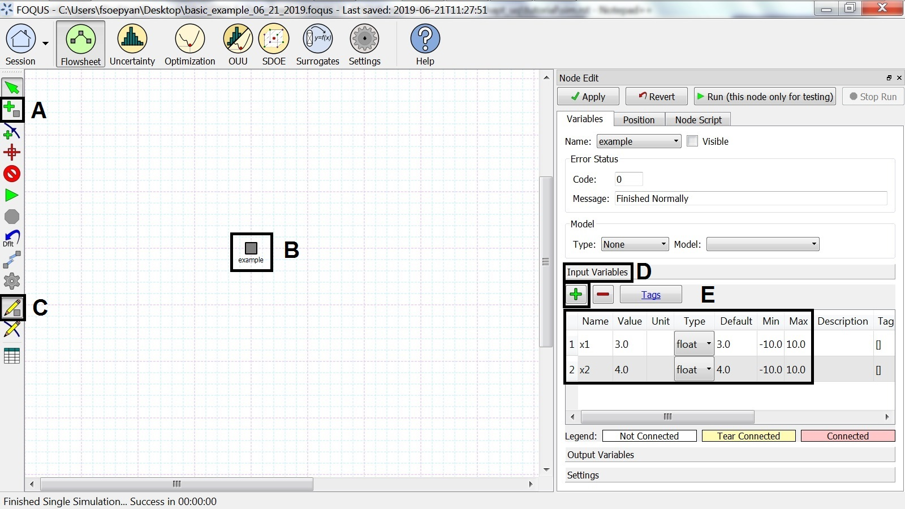

.. _subsec:uqt_sim:

Tutorial 1: Simulation Ensemble Creation and Execution
======================================================

Creating a simulation ensemble using the variables' distributions
~~~~~~~~~~~~~~~~~~~~~~~~~~~~~~~~~~~~~~~~~~~~~~~~~~~~~~~~~~~~~~~~~

In this tutorial, a simulation ensemble is created (using FOQUS) and run.

The FOQUS file for this tutorial is **Rosenbrock_no_vectors.foqus**, and
this file is located in: **examples/tutorial_files/UQ/Tutorial_1**

.. note:: |examples_reminder_text|

#. From the FOQUS main screen, click the **Session** button and then
   select **Open Session** to open a session. Browse to the
   folder shown above, and select the
   “Rosenbrock_no_vectors.foqus" file (Figure
   :ref:`fig.uqt_home`).

   .. figure:: ../figs/tutorial/1_home2.png
      :alt: Home Screen
      :name: fig.uqt_home

      Home Screen

#. Opening this file loads a session that has a flowsheet with one node
   (Figure :ref:`fig.uqt_flowsheet`). See Section
   :ref:`tutorial.simple.flow`
   for a detailed example of creating a flowsheet.

   .. figure:: ../figs/tutorial/2_flowsheet2.png
      :alt: Flowsheet for Rosenbrock Example
      :name: fig.uqt_flowsheet

      Flowsheet for Rosenbrock Example

#. Click the **Uncertainty** button (Figure
   :ref:`fig.uqt_uqhome`).

   .. figure:: ../figs/tutorial/3_UQScreen2.png
      :alt: Uncertainty Quantification Screen
      :name: fig.uqt_uqhome

      Uncertainty Quantification Screen

#. Click Add New to create a new simulation ensemble.

#. The Add New Ensemble dialog displays
   (Figure :ref:`fig.uqt_addnew`). The “Use
   flowsheet” option should be enabled.

#. | *This item describes additional features and is provided for
     information only. It is not intended to be followed as part of the
     step-by-step tutorial.*
   | An alternative is to use an emulator by selecting “Use emulator.” This
     alternative is preferred if the actual simulation model is too
     computationally expensive to be practical for a large number of samples.
     This option enables the user to trade off accuracy for speed by training
     a response surface to approximate the actual simulation model. If this
     option is selected (Figure :ref:`fig.uqt_addnew_emulator`), the user needs
     to provide a training data file containing a small simulation ensemble
     generated from the actual simulation model. This training data file should
     be in the PSUADE full file format (see section :ref:`file-formats`).

   -  Click Browse and select the training data file with which to train
      the response surface. The inputs, outputs and response surface
      type is read from the training data and populated accordingly on
      this dialog box.

   -  Select Output(s) of Interest. To select multiple outputs, the user
      can use Shift + Click to select a range, or use Ctrl + Click to
      select/deselect individual outputs.

#. Click OK.

   .. figure:: ../figs/tutorial/4_AddNewEnsemble2.png
      :alt: Add New Ensemble Dialog, Flowsheet Option
      :name: fig.uqt_addnew

      Add New Ensemble Dialog, Flowsheet Option

   .. raw:: latex

      \centering

   .. figure:: ../figs/tutorial/4a_AddNewEnsemble2_Emulator.png
      :alt: Add New Ensemble Dialog, Emulator Option
      :name: fig.uqt_addnew_emulator

      Add New Ensemble Dialog, Emulator Option

   .. raw:: latex

      \resume{enumerate}

#. This displays the Simulation Ensemble Setup dialog box
   (Figure :ref:`fig.uqt_sim` ) that prompts the user
   for options specific to the creation of input samples.

#. Within the Distributions tab, the Distributions Table has all the
   inputs from the flowsheet node, each displayed in its own row.

   #. Click the All Variable button.

   #. Change the Type of “x2” to “fixed.”

   #. Enter 5 into the Default column for “x2.”

   Subsequently, other cells in the row are enabled or disabled
   according to the type selection.

   .. figure:: ../figs/tutorial/5_SimSetup2.png
      :alt: Simulation Ensemble Setup Dialog, Distributions Tab
      :name: fig.uqt_sim

      Simulation Ensemble Setup Dialog, Distributions Tab

   .. raw:: latex

      \suspend{enumerate}

   In this dialog, extra options that are available related to
   simulation ensemble setup are discussed.

   -  Change the PDF of “x6” by exploring the drop-down list in the **PDF**
      column of the **Distributions Table**. The drop-down list is denoted by
      box (9c) in Figure :ref:`fig.uqt_sim_pdfs`. If any of the parametric
      distributions are selected (e.g., “Normal”, “Lognormal”, “Weibull”), the
      user is prompted to enter the appropriate parameters for the selected
      distribution. If non-parametric distribution “Sample” is selected, the
      user needs to specify the name of the sample file (a CSV or PSUADE sample
      format is located in Section :ref:`file-formats`) that contains samples
      for the variable “x6.” The user also needs to specify the output index
      to indicate which output in the sample file to use. The resulting
      simulation ensemble would contain “x6” samples that are randomly
      drawn (with replacement) from the samples in this file.

      .. figure:: ../figs/tutorial/6_SimSetupPDFs2.png
         :alt: Simulation Ensemble Setup Dialog, Distributions Tab, PDF
         :name: fig.uqt_sim_pdfs

         Simulation Ensemble Setup Dialog, Distributions Tab, PDF
         Selection

   -  Alternatively, select Choose sampling scheme (box (8) of Figure
      :ref:`fig.uqt_sim`), and try selecting “Load all samples from a single
      file.” With this selection, a new dialog box prompts the user to browse
      to a PSUADE full file, a PSUADE sample file, or CSV file (all formats are
      described in Section :ref:`file-formats`) that contains all the samples
      for all the input variables in the model.

   Both of these options offer the user additional flexibility with
   respect to characterizing input uncertainty or generating the input
   samples directly.

   .. raw:: latex

      \resume{enumerate}

#. Once complete, switch to the Sampling Scheme tab
   (Figure :ref:`fig.uqt_sim_samplescheme`).

   .. figure:: ../figs/tutorial/7_SimSetupSampling2.png
      :alt: Simulation Ensemble Setup Dialog, Sampling Scheme Tab
      :name: fig.uqt_sim_samplescheme

      Simulation Ensemble Setup Dialog, Sampling Scheme Tab

#. Select a sampling scheme with the assumption that the user is unsure
   which sampling scheme to use, but wants to perform some kind of
   response surface analysis. This example helps the user find a
   suitable one.

   #. Click For response surface analysis. Note the list on the right
      changes accordingly.

   #. Select “Latin Hypercube” from the list on the right.

#. To generate 500 samples, change the value in “# of samples.” Some
   sampling schemes may impose a constraint on the number of samples. If
   the user has entered an incompatible sample size, a pop-up window
   displays with guidance on the recommended samples size.

#. Click Generate Sample\ s to generate the sample values for all the
   variable input parameters. On Windows, if the user did not install
   PSUADE in its default location (C:\Program Files (x86)\psuade_project
   1.7.1\bin\psuade.exe) and the user did not update the PSUADE path in
   FOQUS settings (refer to
   Section :ref:`section.settings`), then the user is
   prompted to locate the PSUADE executable in a file dialog.

#. Once the samples are generated, the user can examine them by clicking
   Preview Samples. This displays a table of the values, as well as the
   option to view scatter plots of the input values. The user can also
   select multiple inputs at once to view them as separate scatter plots
   on the same figure.

#. When finished, click Done.

#. The simulation ensemble should be displayed in the Simulation
   Ensemble Table. If the user would like to change any of the
   parameters and regenerate a new set of samples, simply click the
   Revise button.

#. Next, calculate the output value for each sample. Click Launch. The
   user should see the progress bar quickly advance, displaying the
   status of completed runs
   (Figure :ref:`fig.uqt_ensem_added`).

   .. figure:: ../figs/tutorial/8_EnsembleAdded3.png
      :alt: Simulation Ensemble Added
      :name: fig.uqt_ensem_added

      Simulation Ensemble Added

#. Next, look at the output.

   #. Click Analyze for “Ensemble 1”
      (Figure :ref:`fig.uqt_ensem_complete`).

      .. figure:: ../figs/tutorial/9_EnsembleEvalComplete3.png
         :alt: Simulation Ensemble Evaluation Complete
         :name: fig.uqt_ensem_complete

         Simulation Ensemble Evaluation Complete

   #. Step 1 of “Analysis” (bottom page), the user selects Ensemble Data
      (Figure :ref:`fig.uqt_analysis`).

      .. figure:: ../figs/tutorial/10_AnalysisDialog3.png
         :alt: Simulation Ensemble Analysis
         :name: fig.uqt_analysis

         Simulation Ensemble Analysis

   #. Step 2 of “Analysis” is to select “Rosenbrock.f”
      (Figure :ref:`fig.uqt_analysis`).

   #. Step 3 of “Analysis” is to keep the analysis method as
      “Uncertainty Analysis” and then click Analyze. The user should see
      two graphs displaying the probability and cumulative distributions
      plots (Figure :ref:`fig.10a.rosenua`). Users should keep in mind
      these figures are intended to show what type of plots they would get, 
      but they should not expect to reproduce the exact same plots.

   .. figure:: ../figs/tutorial/10a_RosenbrockUA2.png.png
      :alt: Uncertainty Analysis Results
      :name: fig.10a.rosenua

      Uncertainty Analysis Results

Prior to this, the “Rosenbrock” example was selected to illustrate the
process of creating and running a simulation ensemble because
simulations complete quickly using this simple model. But from this
point on, the adsorber subsystem of the A650.1 design is used as a
motivating example to better illustrate how one would apply UQ within
the context of CCSI.

A quick recap on our motivating example: The A650.1 design consists of
two coupled reactors: (1) the two-stage bubbling fluidized bed adsorber
and (2) moving bed regenerator, in which the output (outlet of sorbent
stream) from one reactor is the input (inlet) for the other. The
performance of the entire carbon capture system is obtained by solving
these two reactors simultaneously, accounting for the interactions
between the reactors. However, it is also necessary to study the
individual effects of the adsorber and the regenerator without the side
effects of their coupling since the two reactors display distinct
characteristics under different operating conditions. Thus, the Process
Design/Synthesis Team has given us a version of the A650.1 model that
can be run in two modes: (1) coupled and (2) decoupled. In this section,
analysis results are presented from running the A650.1 model using the
decoupled mode and examining the adsorber in isolation from the
regenerator.

Automatically running FOQUS for a set of user-defined input conditions
~~~~~~~~~~~~~~~~~~~~~~~~~~~~~~~~~~~~~~~~~~~~~~~~~~~~~~~~~~~~~~~~~~~~~~

In this tutorial, we will show you how to automatically run a set of
user-defined input conditions in FOQUS.

This procedure will require the user to specify the input conditions
in a CSV (comma-separated values) Excel file.

We will use a simple example to show the procedure.

1. Open FOQUS.

2. Go to the "Session" tab, and under "Session Name" type: basic_example
   (please see Figure :ref:`fig.Session_Tab`).

   Specifying the Session Name

3. Go to the "Flowsheet" tab, and click the "Add Node" button
   ("A" in Figure :ref:`fig.Flowsheet_Inputs`).

   Inserting a Node and Specifying the Inputs

4. Insert a node called "example" (without the quotes)
   ("B" in Figure :ref:`fig.Flowsheet_Inputs`).

5. Open the Node Editor by clicking the Toggle Node Editor
   button ("C" in Figure :ref:`fig.Flowsheet_Inputs`).

6. Under the Node Editor, click "Input Variables" and the
   green "+" button ("D" in Figure :ref:`fig.Flowsheet_Inputs`).

7. Insert input variables x1 and x2
   ("E" in Figure :ref:`fig.Flowsheet_Inputs`).

8. For x1, specify the value, default, minimum, and maximum as 
   3, 3, -10, and 10, respectively
   ("E" in Figure :ref:`fig.Flowsheet_Inputs`).

9. For x2, specify the value, default, minimum, and maximum as 
   4, 4, -10, and 10, respectively
   ("E" in Figure :ref:`fig.Flowsheet_Inputs`).

10. Under the Node Editor, click "Output Variables" and the
    green "+" button
    ("A" and "B" in Figure :ref:`fig.Flowsheet_Outputs`).

 .. figure:: ../figs/tutorial/Flowsheet_Outputs.jpg
    :alt: Specifying the Outputs
    :name: fig.Flowsheet_Outputs

    Specifying the Outputs

11. Insert output variables y1 and y2
    ("C" in Figure :ref:`fig.Flowsheet_Outputs`).

12. Under the Node Editor, click "Node Script"
    ("A" in Figure :ref:`fig.Flowsheet_Equations`).

 .. figure:: ../figs/tutorial/Flowsheet_Equations.jpg
    :alt: Inserting the Equations
    :name: fig.Flowsheet_Equations

    Inserting the Equations

13. In the first line under "Node Script (Python Code)",
    type: f['y1'] = 2 * x['x1'] + 3 * x['x2']
    ("B" in Figure :ref:`fig.Flowsheet_Equations`).

14. In the second line under "Node Script (Python Code)",
    type: f['y2'] = 3 * x['x1'] + 5 * x['x2']
    ("B" in Figure :ref:`fig.Flowsheet_Equations`).

15. Open Microsoft Excel.

16. Type example.x1 and example.x2 as the headings
    in Cells A1 and B1
    (please see Figure :ref:`fig.Excel_Samples`).

 .. figure:: ../figs/tutorial/Excel_Samples.jpg
    :alt: Specifying the Inputs in Excel
    :name: fig.Excel_Samples

    Specifying the Inputs in Excel

17. Type 1, 3, 5, 7, 9 under example.x1
    (please see Figure :ref:`fig.Excel_Samples`).

18. Type 0, 2, 4, 6, 8 under example.x2
    (please see Figure :ref:`fig.Excel_Samples`).

19. Save the Excel file, with file name "example_samples"
    (without the quotes), and "CSV (MS-DOS)" as the file type .

20. Return to FOQUS, and go to the "Uncertainty" tab
    ("A" in Figure :ref:`fig.UQ_Tab`).

 .. figure:: ../figs/tutorial/UQ_Tab.jpg
    :alt: The Uncertainty Tab in FOQUS
    :name: fig.UQ_Tab

    The Uncertainty Tab in FOQUS

21. Click the "Add New" button
    ("B" in Figure :ref:`fig.UQ_Tab`).

22. Select "Use flowsheet", and click "OK"
    ("C" and "D" in Figure :ref:`fig.UQ_Tab`).

23. Select "Load all samples from a single file"
    ("A" in Figure :ref:`fig.CSV_Upload`).

 .. figure:: ../figs/tutorial/CSV_Upload.jpg
    :alt: Uploading the CSV File Containing the Inputs
    :name: fig.CSV_Upload

    Uploading the CSV File Containing the Inputs

24. Click "Browse", and select the "example_samples" CSV file
    ("B" in Figure :ref:`fig.CSV_Upload`).

25. Click "Done" ("C" in Figure :ref:`fig.CSV_Upload`).

26. The user-specified inputs should appear in the "Ensemble" table
    (please see Figure :ref:`fig.Run_Samples`).

 .. figure:: ../figs/tutorial/Run_Samples.jpg
    :alt: The User-Specified Inputs in the Uncertainty Tab
    :name: fig.Run_Samples

    The User-Specified Inputs in the Uncertainty Tab

27. Run these inputs by clicking the "Launch" button
    (please see Figure :ref:`fig.Run_Samples`).

28. After the runs are finished, the results are shown
    in the table at the bottom of the "Uncertainty" tab
    (please see Figure :ref:`fig.UQ_Done`).

 .. figure:: ../figs/tutorial/UQ_Done.jpg
    :alt: The Results of the Runs in the Uncertainty Tab
    :name: fig.UQ_Done

    The Results of the Runs in the Uncertainty Tab

29. The user can also view the results in the Flowsheet tab
    by clicking the "Results and Filtering" button
    ("A" in Figure :ref:`fig.Flowsheet_Results`).

 .. figure:: ../figs/tutorial/Flowsheet_Results.jpg
    :alt: The Results of the Runs in the Flowsheet Table
    :name: fig.Flowsheet_Results

    The Results of the Runs in the Flowsheet Table

30. The Flowsheet Table contains the results
    ("B" in Figure :ref:`fig.Flowsheet_Results`).
