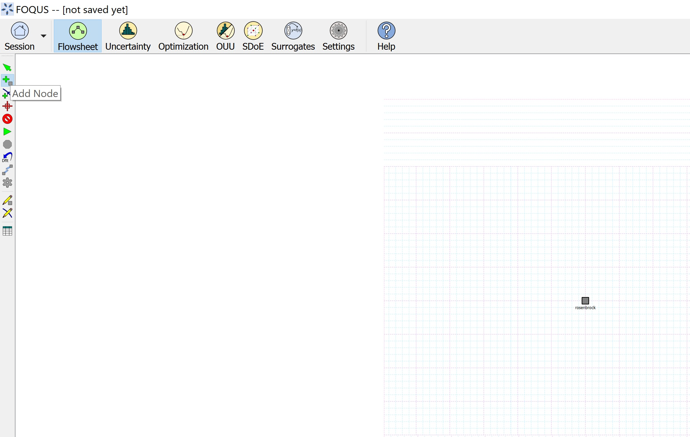
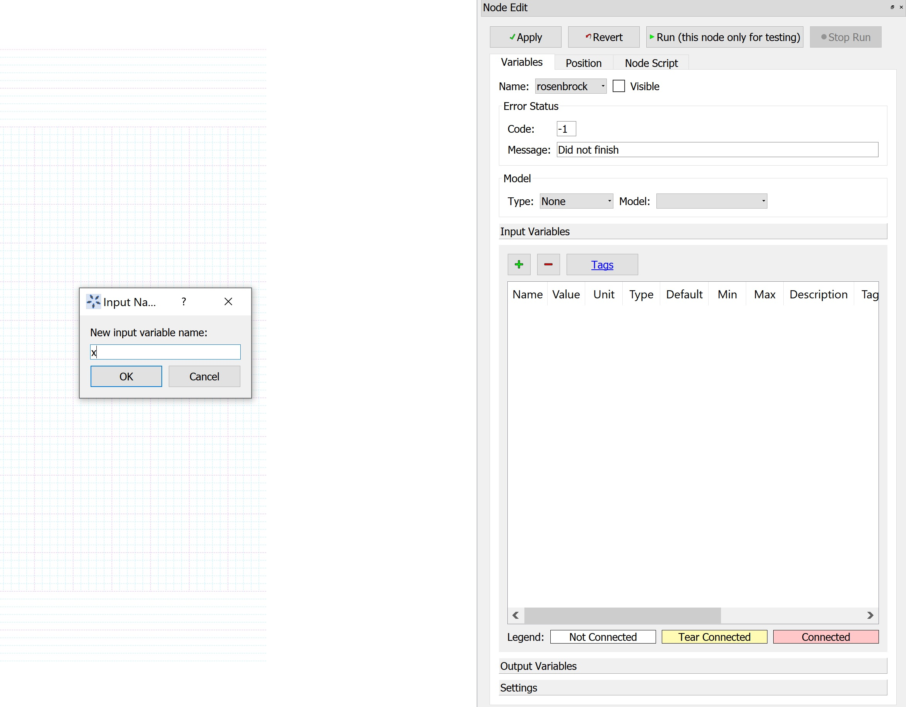
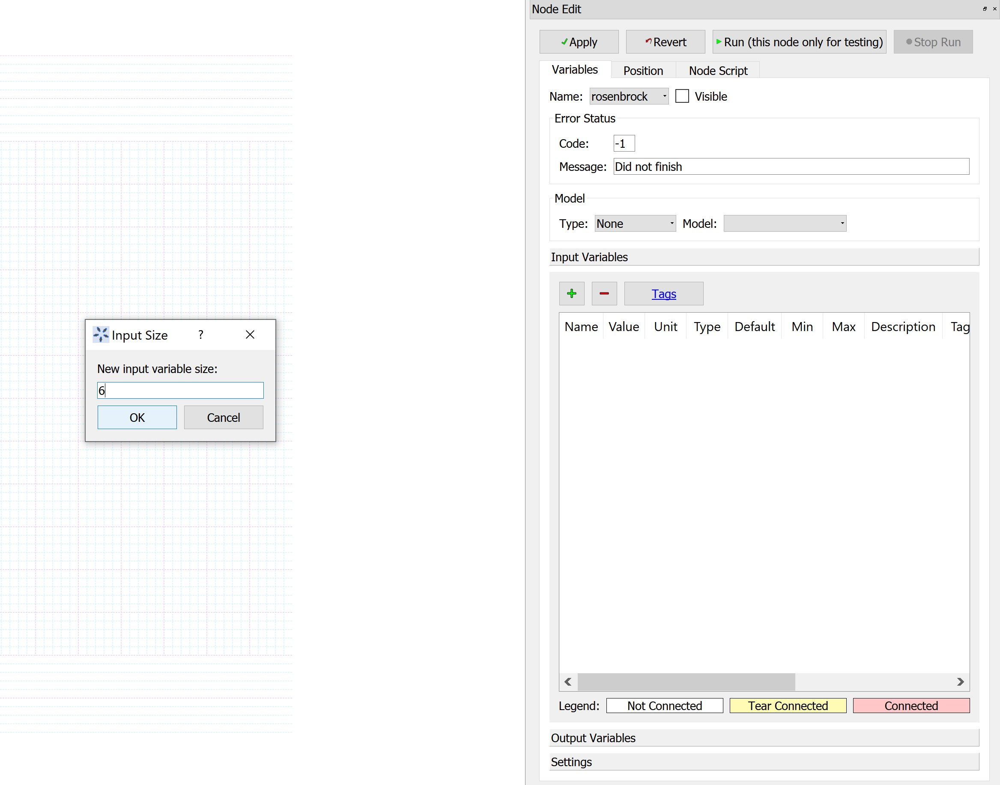
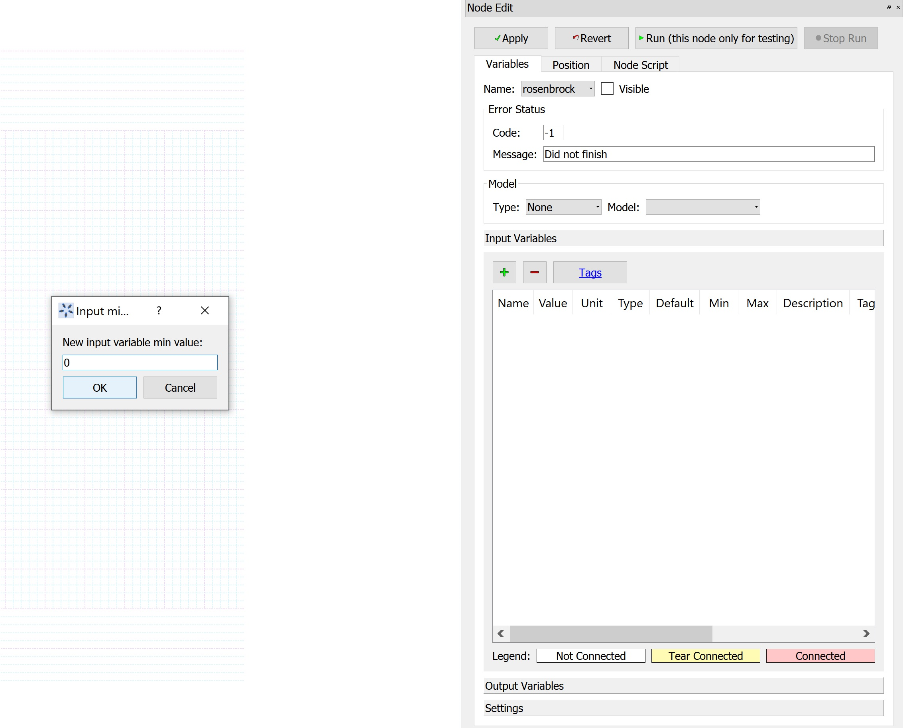
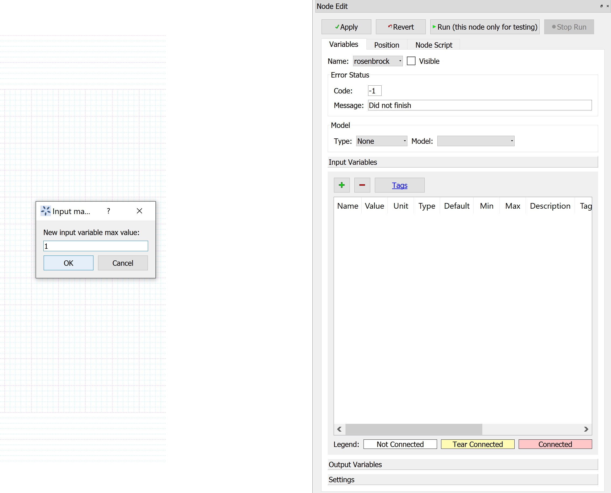
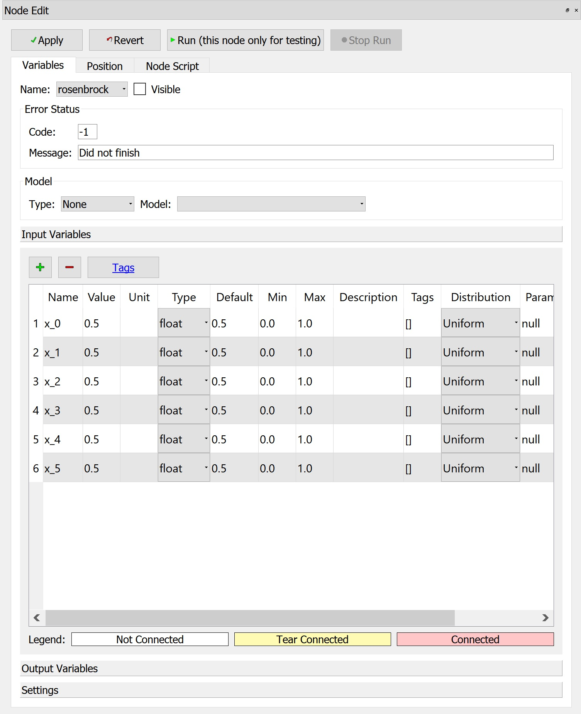
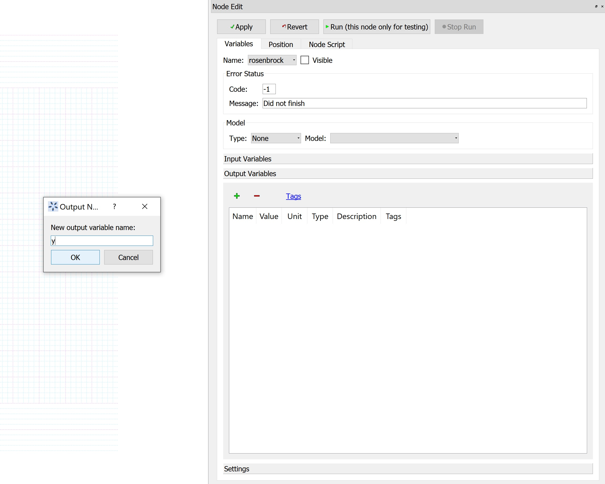
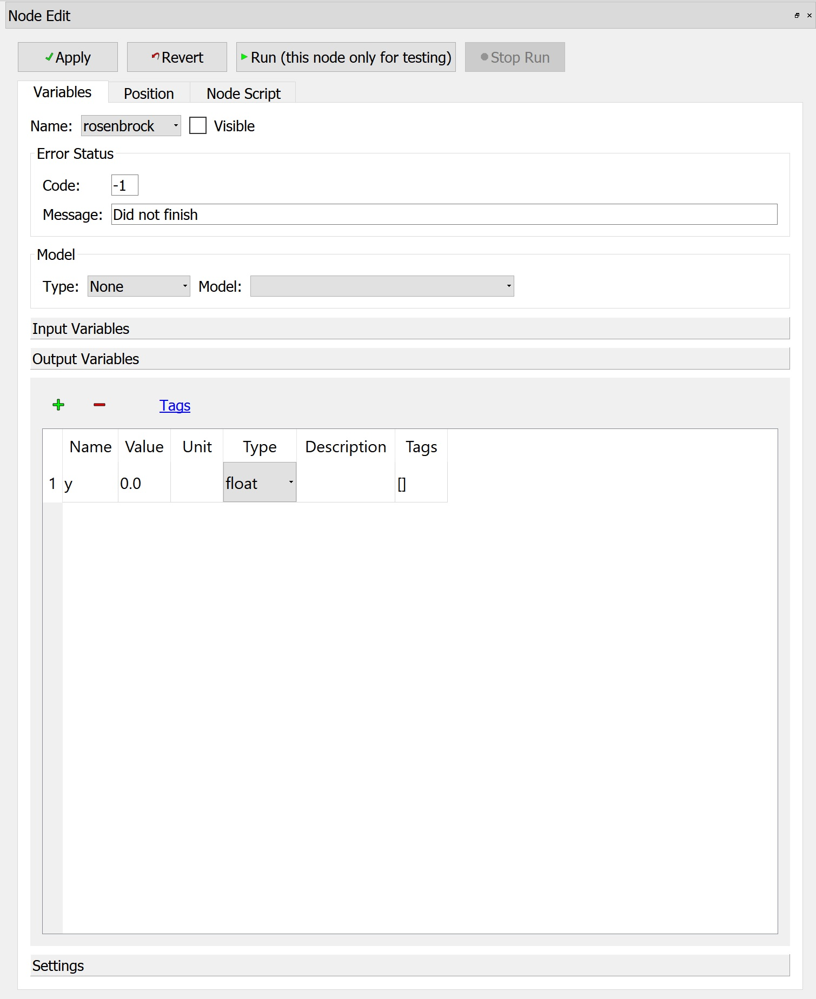
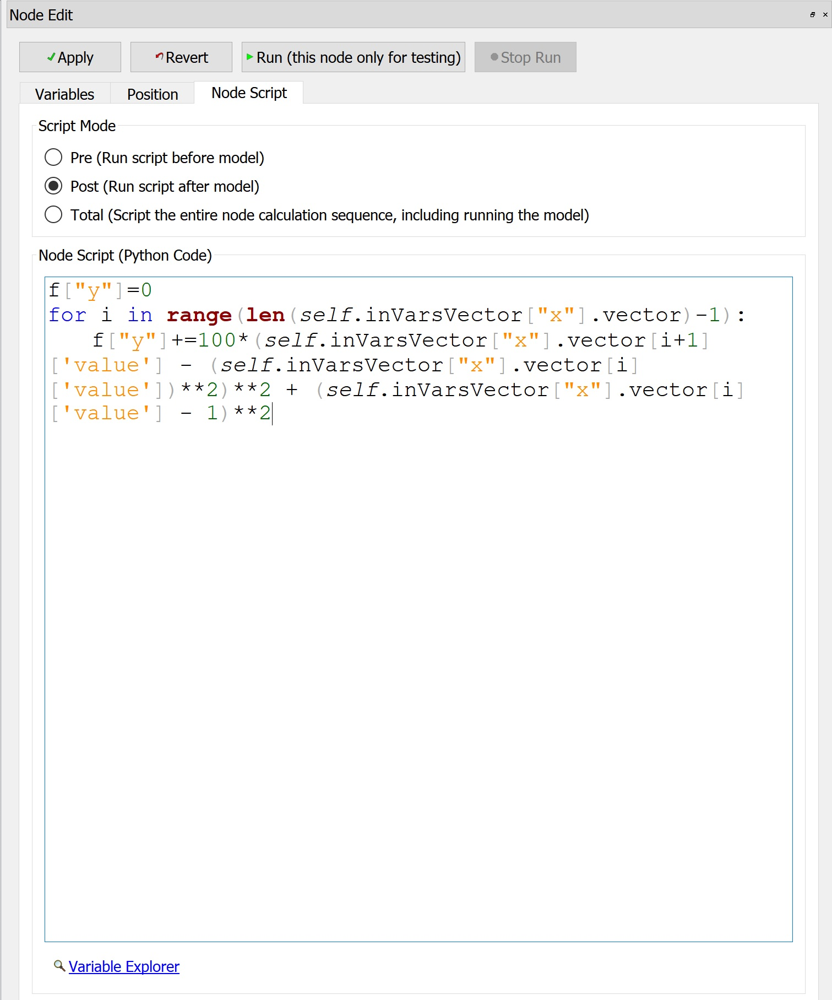
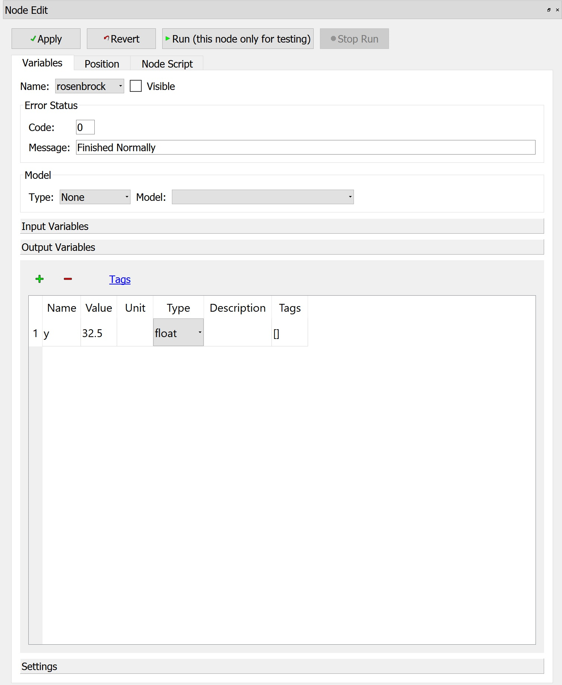

Example 1 - Handling Vector Variables in Python Models
======================================================

**Problem Statement**: Consider the multi-dimensional Rosenbrock function:

.. math:: \sum_{i=0}^{4} 100(x_{i+1} - x_{i}^2)^2 + (x_{i} - 1)^2

Set up the Python based function in a FOQUS flowsheet node using an input vector
variable. Further simulate the function in the FOQUS flowsheet.

*Reference*: https://www.sfu.ca/~ssurjano/rosen.html

**Instructions**

*Step 1*: Create a FOQUS node named 'rosenbrock' in the flowsheet section,
as shown in Figure 1.

   Figure 1: FOQUS node for Rosenbrock function

*Step 2*: Open the node editor and under 'Input Variables' section, click on '+'
to add a new input variable.
Further, in the user interface prompt, enter the variable name 'x' as shown in
Figure 2, and click Ok.

   Figure 2: Add input vector variable 'x'

*Step 3*: In the next user interface prompt, enter 6 as the size of the variable
as shown in Figure 3, and click Ok.
This would correspond to the number of elements in the vector, if size is
greater than 1.

   Figure 3: Specify size of the input vector variable

*Step 4*: In the next user interface prompt, enter 0 as the minimum value for
the variable elements, shown in Figure 4, and click Ok.

   Figure 4: Specify minimum value of the input vector variable elements

*Step 5*: In the next user interface prompt, enter 1 as the maximum value for
the variable elements, shown in Figure 5, and click Ok.

   Figure 5: Specify maximum value of the input vector variable elements

*Step 6*: In the next user interface prompt, enter 0.5 as the value for the
variable elements, shown in Figure 6, and click Ok.
These are the values at which the simulation would run.

.. figure:: ../figs/add_ip_vector_var_5.png
   :alt: Figure 6: Specify value of the input vector variable elements
   :name: fig.add.ip.vector.var.5

   Figure 6: Specify value of the input vector variable elements

At this point in the implementation, the 'Input Variables' section of the node
editor is populated with the vector variable elements x_0 through x_5,
(which correspond to vector variable 'x') as shown in Figure 7.

   Figure 7: Input vector variable elements in Node Panel

*Step 7*: Under 'Output Variables' section, click on '+' to add a new output
variable.
Further, in the user interface prompt, enter the variable name 'y' as shown in
Figure 8, and click Ok.

   Figure 8: Add output scalar variable 'y'

*Step 8*: In the next user interface prompt, enter 1 as the size of the variable
(since it is a scalar), as shown in Figure 9, and click Ok.

   Figure 9: Specify size of the output variable

At this point in the implementation, the 'Output Variables' section of the node
editor is populated with the scalar variable y as shown in Figure 10.

   Figure 10: Output variable in Node Panel

*Step 9*: Enter the Rosenbrock function in the node script (set to 'post' mode)
in python format, as shown in Figure 11.

   Figure 11: Rosenbrock function in Node Script

In order to access the input vector variable element values in the node script,
the syntax to be used is:
self.inVarsVector["vector_name"].vector[index]['value'], where the index ranges
from 0 to (size-1)
Eg. In this case, if the value of 1st element of "x" needs to be accessed,
we would specify: self.inVarsVector["x"].vector[0]['value']

*Step 10*: Run the flowsheet simulation, and the output variable value is
displayed, as shown in Figure 12.

   Figure 12: Simulation Result

The simulation runs successfully, and the output variable value is obtained as
per the Rosenbrock function set up in the node script, corresponding to the
input vector element values.

It is to be noted that the functioning of other FOQUS modules like UQ,
Optimization, and Surrogate Modeling is not affected by introducing vector
variables. The individual scalar variables corresponding to the vectors get
displayed in the user interface of these modules.

**Important points to be noted**

1. If the size specified for an input or output variable is greater than 1,
the variable is constructed as a vector, and for size = 1, it is created as a
scalar.

2. The vector elements are separate scalar node variables that get created,
and grouped together in a node vector variable object 'x', in the background of
FOQUS. Hence, 'x' can be considered as a vector variable that gets created in
the background, to store the scalar variables corresponding to its elements, at
specific index locations.

3. Each scalar variable corresponding to the vector takes the bounds and values
from the user interface prompt.
Note that in order to specify different bounds and values for each vector
element, the user can provide a list with values specific to the elements.
For this example, if the node needs to be simulated for different values of
each vector element, when prompted for the values, the user can enter the list
[val_0, val_1, .. val_5] in the interface, where val_0, val_1.. val_5 are
distinctly specified values for each element by the user.

4. The output vector variables are constructed in a similar manner, as the
input vector.

5. In order to access the input or output vector variable element values in the
node script, the syntax to be used is:

self.inVarsVector["vector_name"].vector[index]['value'] for input vector
variable elements, and
self.outVarsVector["vector_name"].vector[index]['value'] for output vector
variable elements where the index ranges from 0 to (size-1)

6. The syntax for accessing the scalar variables, created standalone, or
associated with a vector, remains the same.
