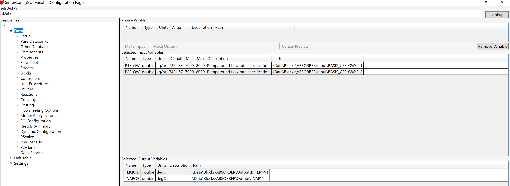
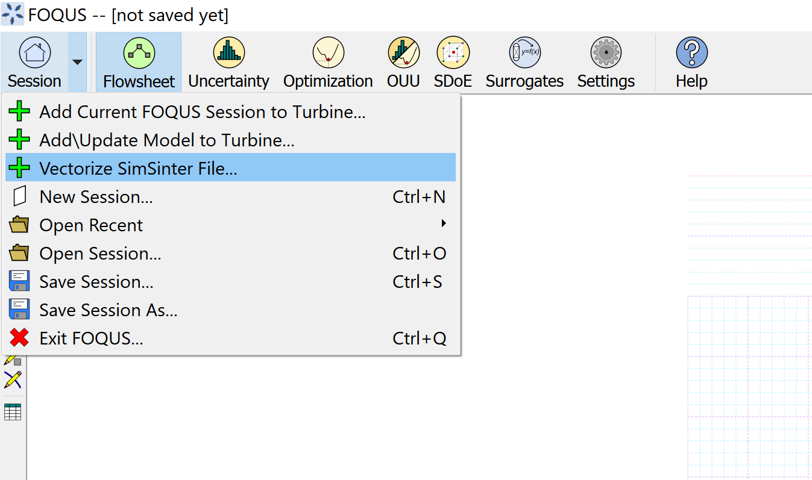
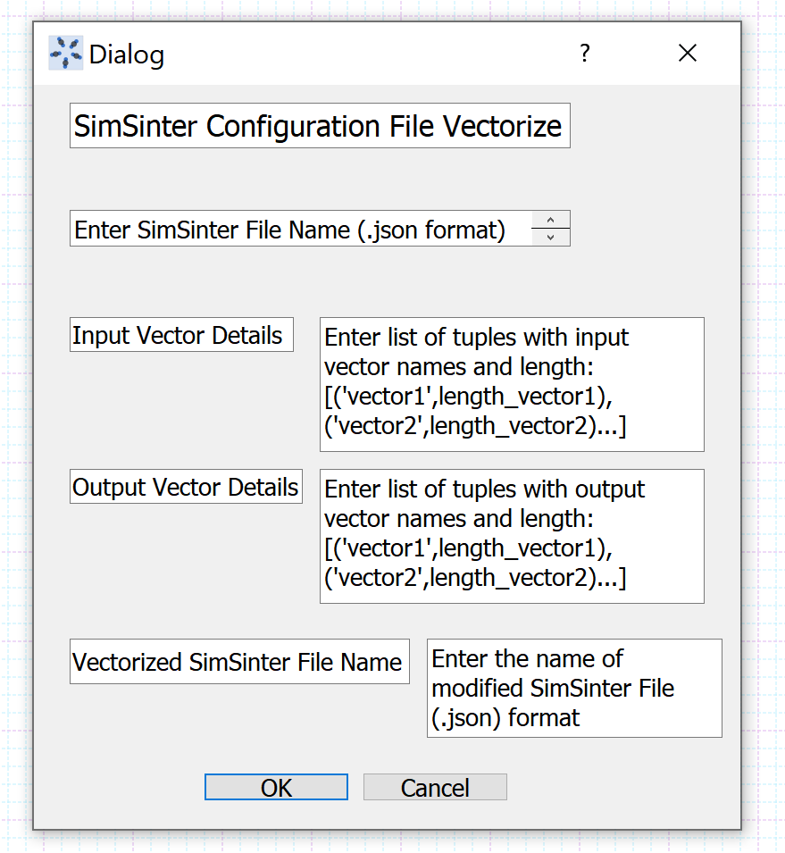
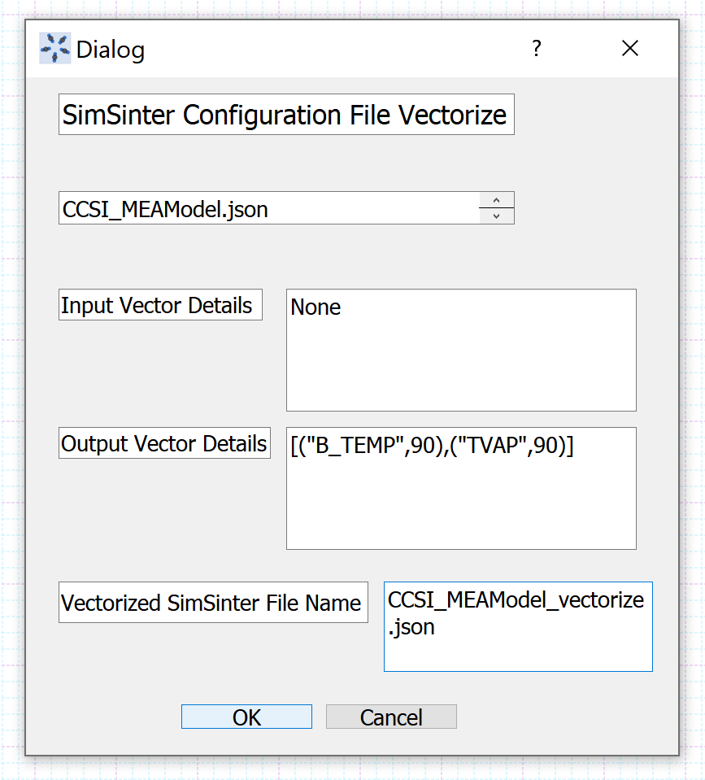
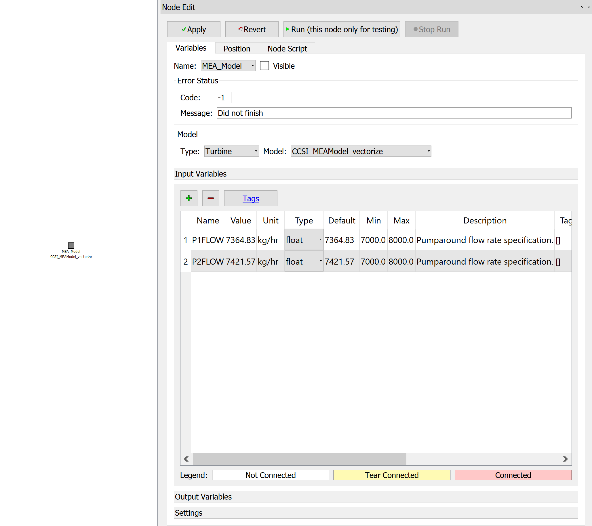
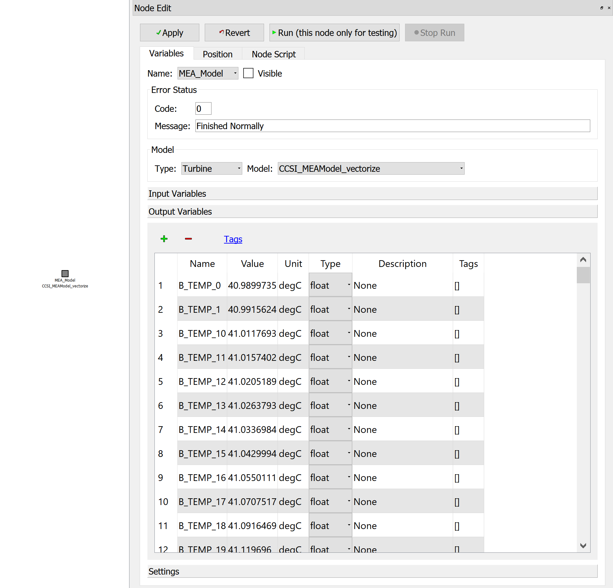

Example 2 - Handling Vector Variables in Aspen Plus Models
==========================================================

**Problem Statement**: Consider the MEA solvent based carbon capture system in
the MEA_ssm product, as a part of the CCSI-Toolset on GitHub.

An application of vector variable support for Aspen Plus models in FOQUS is
accessing the temperature, pressure, or composition profiles along a separation
column, and observing the change in profile with variations in process
parameters or configurations.

In this example, for the same simulation conditions specified in
CCSI_MEAModel.bkp, we will access the absorber temperature profile for liquid
and vapor phases as an output vector variable in FOQUS.

The absorber intercooler cooling water flowrates will be accessed
as scalar input variables, in order to observe changes in the absorber
temperature profile, with its variation, as a potential application for the user

Set up the Aspen Plus model, CCSI_MEAModel.bkp, in a FOQUS flowsheet node with
the input and output variables as mentioned above.
Further simulate the model in the FOQUS flowsheet for the original conditions
provided in the Aspen file.

**Instructions**

*Step 1*: Create a SimSinter file named CCSI_MEAModel.json based on
CCSI_MEAModel.bkp, ccsi10.dll, and ccsi.opt, using the SinterConfigGUI, as shown
in Figure 1.

   Figure 1: Setting up the initial SimSinter file

In order to create the file, access the pumparound flowrates of the absorber as
input variables, and temperatures of liquid, vapor phases at the first stage of
absorber, following the 'Path' shown in the figure, for navigating
through the variable tree in the GUI.

This would create an initial, non-vector SimSinter file, which will be used as a
basis for vectorizing it in the next steps.

*Step 2*: Add the following files to the FOQUS Working Directory:
CCSI_MEAModel.json, CCSI_MEAModel.bkp, ccsi10.dll, ccsi.opt.

*Step 3*: Open a FOQUS session, and give it an appropriate name.
Further, click the Session tab dropdown, and select the
"Vectorize SimSinter File" option, as shown in Figure 2.

   Figure 2: Select the option to vectorize SimSinter file

A user interface dialog box with the heading "SimSinter Configuration File
Vectorize" will be displayed as shown in Figure 3.

   Figure 3: User interface for vectorizing SimSinter file

*Step 4*: In the user interface dialog shown in Step 3:
          (i) Enter the SimSinter file name, CCSI_MEAModel.json, in the text box
          under the heading.

          (ii) Enter None in the text box next to "Input Vector Details", since
          we don't have any input vectors of interest in our Aspen model.

          (iii) Next to "Output Vector Details", enter a list of tuples, each
          one containing the vector variable name as string type,
          (according to the variable tree in SimSinter), and the number of
          elements required as a part of the vector.

          In this case, "B_TEMP" is the variable name corresponding to the
          liquid phase temerature along the absorber column, and "TVAP" is the
          variable name corresponding to the vapor phase temerature along the
          absorber column, according to their path in SimSinter.
          These vector variables are indexed over the absorber stages, which is
          why the number of elements in each of them would be 90.
          Hence, enter the list [("B_TEMP",90),("TVAP",90)] in the text box.

          (iv) Enter CCSI_MEAModel_vectorize.json in the text box next to
          "Vectorize SimSinter File Name".

After entering the user inputs for vectorizing the SimSinter file, the dialog
box must resemble Figure 4:

   Figure 4: User inputs entered for vectorizing SimSinter file

Click "Ok" and wait for the dialog box to disappear.

*Step 5*: In the FOQUS working directory, check whether the file
CCSI_MEAModel_vectorize.json has been created. If it hasn't been created, repeat
steps 3 and 4 with the correct user inputs. If it is created, open the json file
directly to check whether it has been modified correctly.

In the json file, the dictionary corresponding to the "outputs" key must contain
180 scalar variables 90 each corrsponding to the vector variables "B_TEMP" and
"TVAP". Each scalar output variable corresponding to the vector must contain a
"vector" field which includes the vector variable it is associated with, and an
"index" field, which defines its location in the vector. The indices range from
0 to (size-1), where size is the number of elements in the vector.
Also, its path must correctly correspond to the one in the SimSinter
variable tree.

*Step 6*: Under the "Section" dropdown in FOQUS, click on
"Add\Update Model to Turbine", browse and upload CCSI_MEAModel_vectorize.json
to Turbine, through the user interface that gets displayed.

*Step 7*: In the "Flowsheet" section, create a node named "MEA_Model".
Open the node editor, select Model Type "Turbine", and Model
"CSI_MEAModel_vectorize".

Once the turbine model is loaded in the FOQUS node, the scalar input variables
get displayed as shown in Figure 5.

   Figure 5: Turbine Model loaded in FOQUS node - Inputs

The scalar output variables associated with the vector variables "B_TEMP"
and "TVAP" get displayed as shown in Figure 6.

   Figure 6: Turbine Model loaded in FOQUS node - Outputs

Note that the output variable values will get loaded based on the status of the
Aspen file that was used to build the original SimSinter file. The values
displayed in the above figure already correspond to the Aspen file run and saved
with results based on the original simulation inputs.

*Step 8*: Run the flowsheet simulation, to ensure that it has been set up
correctly.

Once it runs successfully, the user can obtain the absorber temperature profiles
for different values of cooling water flowrates, as per the requirement,
by generating a simulation ensemble in the UQ module of FOQUS.

**Important points to be noted**

1. In the "SimSinter Configuration File Vectorize" dialog box, the syntax for
entering the input as well as output vector details is the same.

2. In order to access the input or output vector variable element values in the
node script, the syntax to be used is:

self.inVarsVector["vector_name"].vector[index]['value']
for input vector variable elements, and
self.outVarsVector["vector_name"].vector[index]['value'] for output vector
variable elements, where the index ranges from 0 to (size-1)

3. In order to access the input or output vector variable element values in the
optimization module for specifying the objective function or constraint,
the syntax to be used is:

x["node_name"]["vector_name"][index] for input vector variables
f["node_name"]["vector_name"][index] for output vector variables

node_name is the name of the FOQUS node
vector_name is the name of the vector from which the elements need to be
accessed index corresponds to the element's location in the vectors

The vector name and index can be found in the "vector" and "index" fields of the
scalar variables associated with the vector, in the vectorized json file.

4. The syntax for accessing the scalar variables, created standalone, or
associated with a vector, remains the same.
